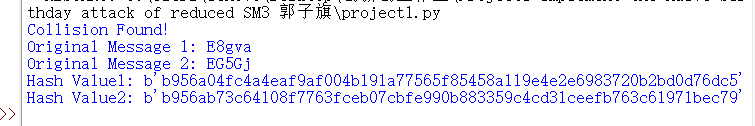

## 原理阐述
生日攻击是一种利用概率论原理的密码学攻击方法，其基本原理源自于生日悖论。生日悖论指的是在一个较小的随机样本中，存在相同元素的概率大于人们通常直觉所期待的概率。\

对于生日攻击来说，假设哈希函数的输出值长度为n比特，那么理论上来说，我们需要尝试2^n次输入，才能找到一个哈希冲突（两个不同的输入产生相同的哈希值）。然而，利用生日悖论，生日攻击能够在远远少于2^n次尝试的情况下，找到哈希冲突的可能性。\

生日攻击的基本步骤如下：\

攻击者预先生成一组随机的消息（例如，随机字符串或数据），并计算它们的哈希值。\
攻击者将这些哈希值进行存储和比较，以寻找相同的哈希值。\
当找到两个不同的消息产生相同的哈希值时，就发生了哈希冲突，这被称为生日碰撞。\
关键在于生日攻击的成功并不是找到特定的两个输入产生冲突，而是找到任意两个输入之间的冲突。随着尝试的次数增加，概率逐渐升高，直到最终找到冲突的消息对。\

## 代码实现
这个代码的实现没什么细节可说的，就是先调用gmssl库实现sm3，在生成随机字符串来寻找碰撞即可。因为时间缘故，我这里给出了一个5bit碰撞的例子。
```python
from gmssl import sm3
from time import time
from itertools import permutations
import random
helloworld='abcdefghijklmnopqrstuvwxyzABCDEFGHIJKLMNOPQRSTUVWXYZ0123456789'


def SM3(message):
    message=message.encode()
    message_list=[i for i in message]
    hex_digest = sm3.sm3_hash(message_list)
    Hash=hex_digest.encode()
    return Hash

def birthday_attack(hash_length=10):
    hash_dict = {}
    collision_found = False
    for _ in  range(100000000):
        message = ''.join(random.choice(helloworld) for i in range(hash_length))
        hash_value = SM3(message)

        if hash_value[0:hash_length] in hash_dict:
            a=hash_dict[hash_value[0:hash_length]]
            print("Collision Found!")
            print("Original Message 1:", message)
            print("Original Message 2:",a)
            print("Hash Value1:", hash_value)
            print("Hash Value2:", SM3( a))
            collision_found = True
            break
        else:
            hash_dict[hash_value[0:hash_length]] = message

    if not collision_found:
        print("No collision found after", num_trials, "trials.")


birthday_attack(5)


```

## 结果展示
 
