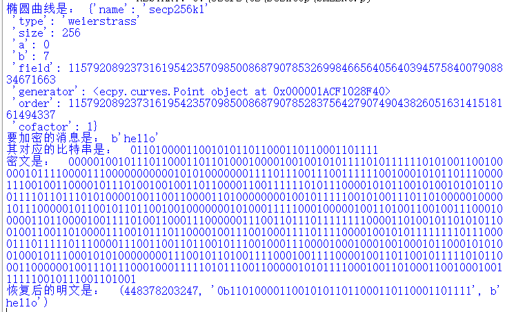
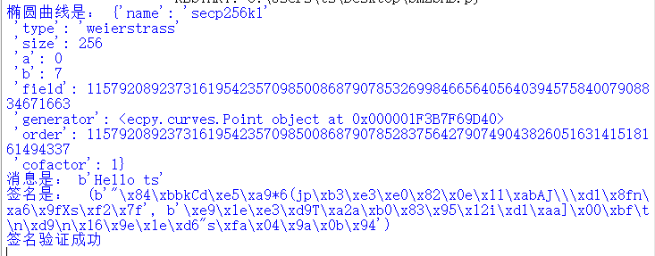




> ## 原理阐释
> SM2是一种国密算法，是中国自主研发的一种非对称加密算法。它基于椭圆曲线密码学（Elliptic Curve Cryptography，ECC）理论，具有高效、安全、轻量级等特点。SM2算法在数字签名、密钥交换、公钥加密等方面广泛应用于信息安全领域。
> ## SM2较RSA优势
> 安全性高。192位的SM2密码强度已经比RSA 2048位密码强度要高。  
> 存储空间小。SM2算法的密码一般使用192－256位，RSA算法密码一般需要使用2048－4096位。  
> 签名速度快。SM2在私钥运算上，速度远比RSA快得多。  
> 国产算法。由国家密码管理部门制订规范，不存在不可公开的密码，保证无国外可利用的后门。
> ## 代码实现
> 我们借助python的ecpy库实现了SM2的签名和加解密。ecpy是轻量级的椭圆曲线的算法库，我们在其基础上进行二次开发，最终实现了SM2.
> 加密关键代码如下：  
>    ```python
>     def _do_encrypt_(self,msg,pu_key,k):
        curve = pu_key.curve
        n     = curve.order
        G     = curve.generator
        C1=k*G
        C1_bit='00000100'+bin(C1.x)[2:]+bin(C1.y)[2:]
        ##print(C1_bit)
        S=k*pu_key.W
        x2=S.x
        x2_bit=bin(x2)[2:]
        y2=S.y
        y2_bit=bin(y2)[2:]
        t=self.KDF(x2_bit+y2_bit,len(msg))
        C2=int(msg,2)^int(t,2)
        C2_bit=bin(C2)[2:]
        C3=hashlib.sha256((x2_bit+msg+y2_bit).encode()).digest()
        C3_bit= ''.join(format(byte, '08b') for byte in C3)
        return (C1_bit+C3_bit+C2_bit,len(C1_bit),len(C2_bit),len(C3_bit),
                len(bin(C1.x)[2:]),len(bin(C1.y)[2:]),len(msg))
        


>
>签名关键代码如下:
>
>```python
>   def _do_sign_(self,msg,pv_key,k):
        if (pv_key.curve == None):
            raise ECPyException('private key haz no curve')
        curve=pv_key.curve
        n=curve.order
        G=curve.generator
        k=k%n
        e = hashlib.sha256(Z+msg).digest()
        e_int = int.from_bytes(e)
        P=k*G
        r = (e_int + P.x) % n
        if(r==0 or r+k==n):
            return None
        d = pv_key.d
        x = pow((1 + d), -1, n)
        s = (x * (k - r * d)) % n
        if(s==0):
            return None
        sign=encode_sig(r,s,self.fmt)
        return sign

>
>


>## 结果展示
>加解密
>
>
>
>
>
>签名与验证
>
>
>
>
>


>|        | 8bits  | 16bits | 24bits | 32bits | 40bits |44bits |48bits |52bits |
>|--------|--------|--------|--------|--------|--------|-------|-------|-------|
>| SM3    | 0.036s | 0.154s | 1.307s | 11.736s|782.692s|1850.594s|       |       |
>| SHA256 | 0.026s | 0.024s | 0.026s | 0.127s | 3.806s |3.877s |51.939s|1504.711s|
>
>


