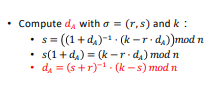
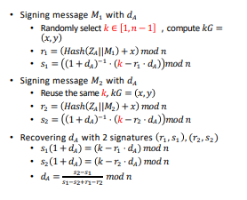
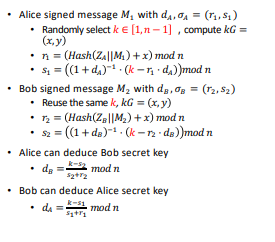
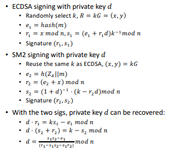




> ## 原理阐释
> 本次实验是针对SM2签名的弱点进行代码实例化攻击。具体有以下四个方面：  
> leaking K
>
> 
> 
>
> 
> reusing K
>
> 
> 
>
> 
> reusing k by different users
>
> 
> 
>
> 
> same d and k with ECDSA
>
> 
> 
>
> 

> ## 代码说明
> 前面的实验，我们已经实现了SM2的签名算法。依照我们写好的程序，对一些弱点进行实例化攻击。  
> 
> leaking K
> 
>    ```python
>     if __name__ == "__main__":
    try:
        ### SM2
        cv     = Curve.get_curve('secp256k1')
        pu_key = ECPublicKey(Point(0x65d5b8bf9ab1801c9f168d4815994ad35f1dcb6ae6c7a1a303966b677b813b00,
                                   
                                   0xe6b865e529b8ecbf71cf966e900477d49ced5846d7662dd2dd11ccd55c0aff7f,
                                   cv))
        pv_key = ECPrivateKey(0xfb26a4e75eec75544c0f44e937dcf5ee6355c7176600b9688c667e5c283b43c5,
                              cv)
        print("椭圆曲线是：",cv)
        ID = b"TangShi"
        entlen = len(ID) * 8
        ENTL = entlen.to_bytes(2, 'big')
        Z = hashlib.sha256(ENTL + ID + bin(cv.a)[2:].encode() + bin(cv.b)[2:].encode()
        + bin(cv.generator.x)[2:].encode()+ bin(cv.generator.y)[2:].encode() +
        bin((pv_key.d * cv.generator).x)[2:].encode() + bin((pv_key.d * cv.generator).y)[2:].encode()).digest()
        signer=SM2()
        sig=signer.sign(b"Hello",Z,pv_key)
        r,s = decode_sig(sig[0],"BTUPLE")
        MY_d=(pow((r+s),-1,cv.order)*(sig[1]-s))%cv.order
        print("d是： ",pv_key.d)
        print("破解的d是： ",MY_d)
        if(pv_key.d==MY_d):
            print("破解成功！! !")
        else:
            print("破解失败。。。")
    finally:
        pass
> reusing K
> 
>```python
>    if __name__ == "__main__":
    try:
        ### SM2
        cv     = Curve.get_curve('secp256k1')
        pu_key = ECPublicKey(Point(0x65d5b8bf9ab1801c9f168d4815994ad35f1dcb6ae6c7a1a303966b677b813b00,
                                   
                                   0xe6b865e529b8ecbf71cf966e900477d49ced5846d7662dd2dd11ccd55c0aff7f,
                                   cv))
        pv_key = ECPrivateKey(0xfb26a4e75eec75544c0f44e937dcf5ee6355c7176600b9688c667e5c283b43c5,
                              cv)
        print("椭圆曲线是：",cv)
        ID = b"TangShi"
        entlen = len(ID) * 8
        ENTL = entlen.to_bytes(2, 'big')
        Z = hashlib.sha256(ENTL + ID + bin(cv.a)[2:].encode() + bin(cv.b)[2:].encode()
        + bin(cv.generator.x)[2:].encode()+ bin(cv.generator.y)[2:].encode() +
        bin((pv_key.d * cv.generator).x)[2:].encode() + bin((pv_key.d * cv.generator).y)[2:].encode()).digest()
        
        signer=SM2()
        ID = b"TangShi"
        entlen = len(ID) * 8
        ENTL = entlen.to_bytes(2, 'big')
        Z = hashlib.sha256(ENTL + ID + bin(cv.a)[2:].encode() + bin(cv.b)[2:].encode() + bin(cv.generator.x)[2:].encode() + bin(cv.generator.y)[2:].encode() + bin((pv_key.d * cv.generator).x)[2:].encode() + bin((pv_key.d * cv.generator).y)[2:].encode()).digest()
        message1=b"Hello ts"
        print("消息是：",message1)
        sig1=signer.sign(message1,Z,pv_key)
        r1,s1 = decode_sig(sig1, "BTUPLE")
        print("签名是： ",sig1)
        message2=b"Hello world"
        print("消息是：",message2)
        sig2=signer.sign(message2,Z,pv_key)
        r2,s2 = decode_sig(sig2, "BTUPLE")
        print("签名是： ",sig2)
        MY_d=((s2-s1)*pow((s1-s2+r1-r2),-1,cv.order))%cv.order
        print("d是： ",pv_key.d)
        print("破解的d是： ",MY_d)
        if(pv_key.d==MY_d):
            print("破解成功！! !")
        else:
            print("破解失败。。。")
    finally:
        pass


>reusing k by different users
>```python
>    if __name__ == "__main__":
    try:
        ### SM2
        cv     = Curve.get_curve('secp256k1')
        pu_key = ECPublicKey(Point(0x65d5b8bf9ab1801c9f168d4815994ad35f1dcb6ae6c7a1a303966b677b813b00,
                                   
                                   0xe6b865e529b8ecbf71cf966e900477d49ced5846d7662dd2dd11ccd55c0aff7f,
                                   cv))
        pv_key = ECPrivateKey(0xfb26a4e75eec75544c0f44e937dcf5ee6355c7176600b9688c667e5c283b43c5,
                              cv)
        pv_key1 = ECPrivateKey(0xfb26a4e75eec75544c0f44e937dce5ee6355c7176600b9688c667e5c283b43c5,
                              cv)
        pu_key1=pv_key1.get_public_key
        print("椭圆曲线是：",cv)
        signer=SM2()
        ##用户A
        ID = b"TangShi"
        entlen = len(ID) * 8
        ENTL = entlen.to_bytes(2, 'big')
        Z = hashlib.sha256(ENTL + ID + bin(cv.a)[2:].encode() + bin(cv.b)[2:].encode()
        + bin(cv.generator.x)[2:].encode()+ bin(cv.generator.y)[2:].encode() +
        bin((pv_key.d * cv.generator).x)[2:].encode() + bin((pv_key.d * cv.generator).y)[2:].encode()).digest()
        ##用户B
        ID1 = b"TS"
        entlen1 = len(ID1) * 8
        ENTL1 = entlen.to_bytes(2, 'big')
        Z1 = hashlib.sha256(ENTL + ID1 + bin(cv.a)[2:].encode() + bin(cv.b)[2:].encode() + bin(cv.generator.x)[2:].encode() + bin(cv.generator.y)[2:].encode() + bin((pv_key.d * cv.generator).x)[2:].encode() + bin((pv_key.d * cv.generator).y)[2:].encode()).digest()
        message=b"Hello ts"
        print("消息是：",message)
        sig1=signer.sign(message,Z1,pv_key)
        r1,s1 = decode_sig(sig1, "BTUPLE")
        print("签名是： ",sig1)
        
        message1=b"Hello world"
        print("消息是：",message1)
        sig2=signer.sign(message1,Z1,pv_key1)
        r2,s2 = decode_sig(sig2, "BTUPLE")
        print("签名是： ",sig2)

        MY_db=((3-s2)*pow(s2+r2,-1,cv.order))%cv.order
        MY_da=((3-s1)*pow(s1+r1,-1,cv.order))%cv.order
        print(pv_key.d)
        print(MY_da)
        if(pv_key.d==MY_da):
            print("用户A的d破解成功!!!")
        else:
             print("用户A的d破解失败。。。")
        print(pv_key1.d)
        print(MY_db)
        if(pv_key1.d==MY_db):
            print("用户B的d破解成功!!!")
        else:
             print("用户B的d破解失败。。。")
    finally:
        pass

> same d and k with ECDSA
> ```python
>    if __name__ == "__main__":
    try:
        ### SM2
        cv     = Curve.get_curve('secp256k1')
        pu_key = ECPublicKey(Point(0x65d5b8bf9ab1801c9f168d4815994ad35f1dcb6ae6c7a1a303966b677b813b00,
                                   
                                   0xe6b865e529b8ecbf71cf966e900477d49ced5846d7662dd2dd11ccd55c0aff7f,
                                   cv))
        pv_key = ECPrivateKey(0xfb26a4e75eec75544c0f44e937dcf5ee6355c7176600b9688c667e5c283b43c5,
                              cv)
        print("椭圆曲线是：",cv)
        signer2=SM2()
        ##用户A
        ID = b"TangShi"
        entlen = len(ID) * 8
        ENTL = entlen.to_bytes(2, 'big')
        Z = hashlib.sha256(ENTL + ID + bin(cv.a)[2:].encode() + bin(cv.b)[2:].encode()
        + bin(cv.generator.x)[2:].encode()+ bin(cv.generator.y)[2:].encode() +
        bin((pv_key.d * cv.generator).x)[2:].encode() + bin((pv_key.d * cv.generator).y)[2:].encode()).digest()

        message2=b"Hello ts"
        print("消息是：",message2)
        sig2=signer2.sign(message2,Z,pv_key)
        r2,s2 = decode_sig(sig2, "BTUPLE")
        print("签名是： ",sig2)
        
        message1=b"Hello world"
        print("消息是：",message1)

        signer1=ECDSA("BTUPLE")
        sig1=signer1.sign_k(message1,pv_key,3)
        r1,s1 = decode_sig(sig1, "BTUPLE")
        e= int.from_bytes(message1, 'big')
        MY_d=((s1*s2-e)*pow(r1-s1*s2-s1*r2,-1,cv.order))%cv.order
        print("d是： ",pv_key.d)
        print("破解的d是： ",MY_d)
        if(pv_key.d==MY_d):
            print("破解成功！! !")
        else:
            print("破解失败。。。")
        
    finally:
        pass

>## 结果展示
>8bits
>
>
>
>
>
>16bits
>
>
>
>
>
>24bits
>
>
>
>
>
>32bits
>
>
>
>
>
>40bits
>
>
>
>
>
>
>
>
>44bits
>
>
>
>
>
>
>
>
>48bits
>
>
>
>
>
>52bits
>
>
>
>
>


>|        | 8bits  | 16bits | 24bits | 32bits | 40bits |44bits |48bits |52bits |
>|--------|--------|--------|--------|--------|--------|-------|-------|-------|
>| SM3    | 0.036s | 0.154s | 1.307s | 11.736s|782.692s|1850.594s|       |       |
>| SHA256 | 0.026s | 0.024s | 0.026s | 0.127s | 3.806s |3.877s |51.939s|1504.711s|
>
>
>


