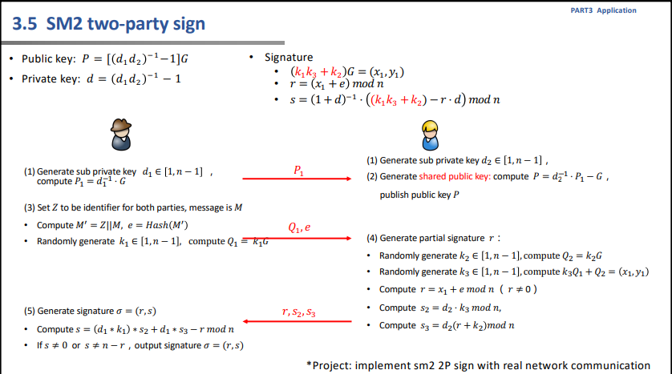
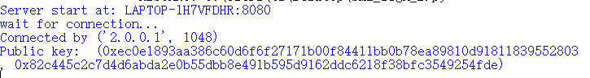
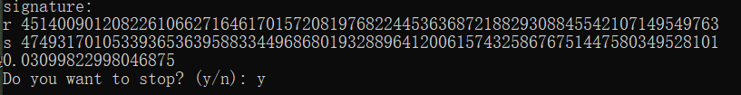
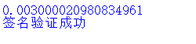
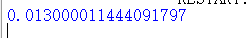

> ## 原理阐释
> SM2两方签名是指在一个签名过程中，涉及两个签名者对同一份消息进行签名。两方签名的原理主要涉及使用SM2椭圆曲线算法进行签名的过程，并可以通过以下步骤来实现：  
>生成密钥对：首先，每个签名者都生成自己的SM2密钥对，包括私钥和公钥。  
>消息摘要：接下来，对待签名的消息进行哈希计算，通常使用SHA-256等哈希算法，得到消息的摘要。  
>生成签名：每个签名者使用自己的私钥和消息摘要，通过SM2椭圆曲线算法计算出相应的签名值。  
>合并签名：两个签名者将各自的签名值进行合并，得到最终的两方签名结果。  
>
> 具体实现原理如图所示：
> 
>
>
> 
> ## 代码说明
> 我们通过构建CS模式来实现真实网络通信中的SM2两方签名，签名（不包括网络通信）代码细节实现如下：
> 
>    ```python
>     d1=ecrand.rnd(n-1)
        d1_inv=pow(d1,-1,n)
        P1=d1_inv*G
        d2=ecrand.rnd(n-1)
        d2_inv=pow(d2,-1,n)
        P=d2_inv*P1-G
        #print("Public key: ",P)
        M="hello"
        Z="AB"
        M_=Z+M
        e= hashlib.sha256(M_.encode()).hexdigest()
        k1=ecrand.rnd(n-1)
        Q1=k1*G
        e_int=int.from_bytes(e.encode())
        k2=ecrand.rnd(n-1)
        Q2=k2*G
        k3=ecrand.rnd(n-1)
        Q4=k3*Q1+Q2
        x1=Q4.x
        y1=Q4.y
        r=(x1+e_int)%n
        s2=(d2*k3)%n
        s3=(d2*(r+k2))%n
        s=((d1*k1)*s2+d1*s3-r)%n
> 
>
>观察上述代码可知，我们生成sub private key d1和d2，计算shared public key P。之后通过生成随机数k1、k2、k3,来得到SM2对应的k=k1*k3+k2.最终，完成对信息的签名。

>## 结果展示
>网络通信结果展示：
>
>服务器端（用户B）
>
>
>
>
>客户端（用户A）
>
>
>
>
>
>速度展示
>
>SM2单方签名
>
>
>
>
>
>SM2两方签名
>
>
>
>
>
>由此可以看出，SM2单方签名比2P模式快四倍左右。两者计算量如图所示：
>
>|        |随机数k | mul_point | 生成公钥 |
>|--------|--------|-----------|----------|
>| SM2单方|   1     | 1        | 无      | 
>| SHA256 | 3       | 3        | 有      | 
>
>


