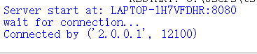
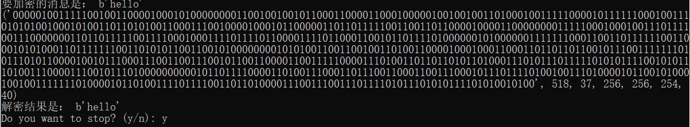
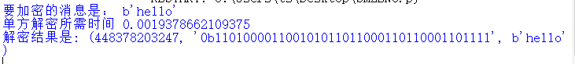
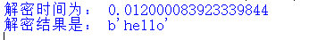

> ## 原理阐释
> SM2两方解密是指在一个解密过程中，涉及两个解密者对同一份消息进行解密。两方解密的原理主要涉及使用SM2椭圆曲线算法进行解密的过程，并可以通过以下步骤来实现：    
>生成密钥对：首先，每个解密者都生成自己的SM2密钥对，包括私钥和公钥。    
>得到KP：双方通过协同生成T1、T2,从而生成KP。  
> 恢复明文：解密者 通过异或操作，得到对应的明文M。  
> 具体实现原理如图所示：
> 
>
>
> 
> ## 代码说明
> 我们通过构建CS模式来实现真实网络通信中的SM2两方解密，解密（不包括网络通信）代码细节实现如下：
> 
>    ```python
>    d2=ecrand.rnd(n-1)
    TS=(pow(d2,-1,n)*G)
    d1=ecrand.rnd(n-1)
    P=pow(d1,-1,n)*TS-G
    pu_key = ECPublicKey(P)
    encryptor=SM2("BTUPLE")
    message=b"hello"
    #print("要加密的消息是：",message)
    message_bit= ''.join(format(byte, '08b') for byte in message)
    #print("其对应的比特串是： ",message_bit)
    cipher=encryptor.encrypt(message_bit,pu_key)
    # print(cipher)
    C1_bit=cipher[0][0:cipher[1]]
    x1_bit=C1_bit[8:8+cipher[4]]
    y1_bit=C1_bit[8+cipher[4]:]
    x1=int(x1_bit,2)
    y1=int(y1_bit,2)
    C1=Point(x1,y1,cv)
    #print("C1",C1)
    C2_bit=cipher[0][(cipher[1]+cipher[3]):]
    ##print(C2_bit)
    T1=(pow(d1,-1,n)*C1)
    T2=pow(d2,-1,n)*T1
    T3=T2-C1
    x2=T3.x
    y2=T3.y
    x2_bit=bin(x2)[2:]
    #print("2b",x2_bit)
    y2_bit=bin(y2)[2:]
    # print("3b",y2_bit)
    t=encryptor.KDF(x2_bit+y2_bit,cipher[-1])
    #print(t)
    M=int(t,2)^int(C2_bit,2)
    M_bit=bin(M)
    dudu=int(M_bit,2)
    num_byte = (dudu.bit_length() + 7) // 8
    M_byte = dudu.to_bytes(num_byte, 'big')
> 
>
>观察上述代码可知，我们生成sub private key d1和d2，计算shared public key P。通过点的运算得到KP，最终通过异或操作得到明文。

>## 结果展示
>网络通信结果展示：
>
>服务器端（用户B）
>
>
>
>
>客户端（用户A）
>
>
>
>
>
>速度展示
>
>SM2单方解密
>
>
>
>
>
>SM2两方解密
>
>
>
>
>
>由此可以看出，SM2单方解密比2P模式快六倍左右。两者计算量如图所示：
>
>|        |随机数k | mul_point | 加密 | KDF|
>|--------|--------|-----------|----------|----|
>| SM2单方|   0     | 1        | 无      | 1    |
>| SM2两方 | 2       | 5        | 有      | 1   |
>
>


