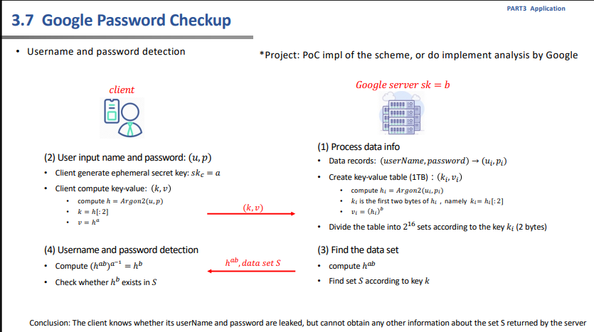

# 实现方式
## Google
Google Chrome 为您提供了一个默认工具，无需安装即可保存您的登录凭据。  
它使用 AES 256 位 SSL/TLS 加密以及密码短语功能，为您的密码和个人信息提供额外的安全性。  
除了生成和保存密码之外，您还可以通过 Chrome 的密码检查查看您的登录信息。该功能默认启用  
## Firefox
Firefox 提供主密码来帮助您访问密码库。它类似于成熟的密码管理器所应用的原理。  
凭借 256 位 AES 加密和主密码功能，Firefox 提供了生成更强密码并安全保存密码的功能。  
此外，您可以使用 Firefox Lockwise 自动填写密码，并启用 Firefox Sync 来跨设备保存和共享密码。  

# Google优势
但谷歌的 Chrome 扩展又向前迈出了重要的一步，它会检查您在网站上输入的登录凭据（用户名或电子邮件地址和密码），并查看它们是否与他们知道之前公开的详细信息相匹配。
毫不奇怪，这可能会让一些用户变得谨慎。如果您知道浏览器扩展程序窥探您的密码，您会感到放心吗？  
然而，谷歌表示，该扩展程序的设计目的是让任何人（包括它自己）都无法访问您的登录信息。  
具体实现流程如图所示：

