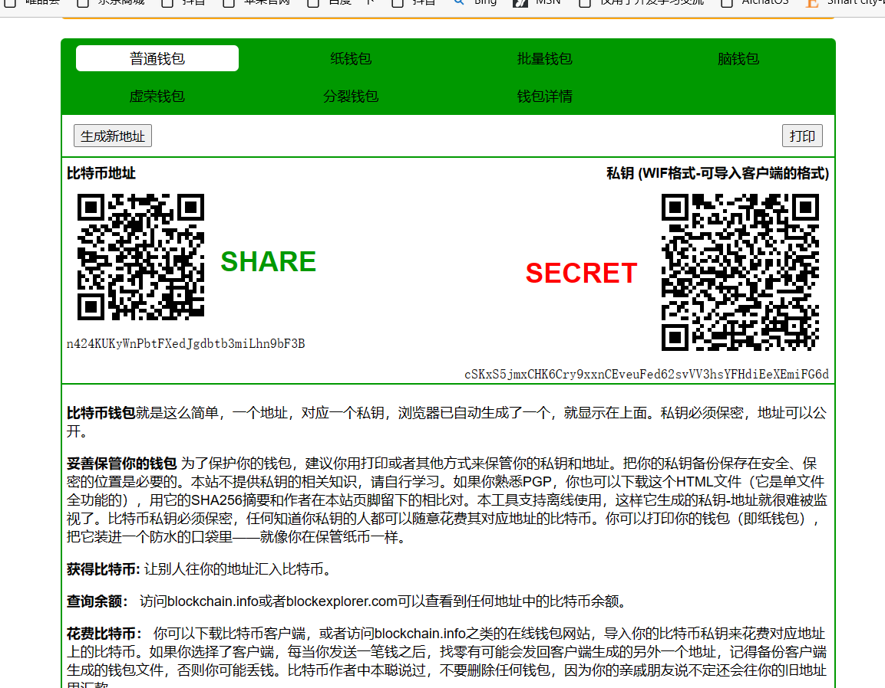
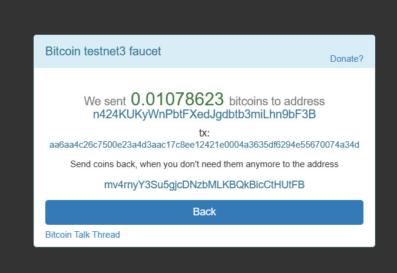
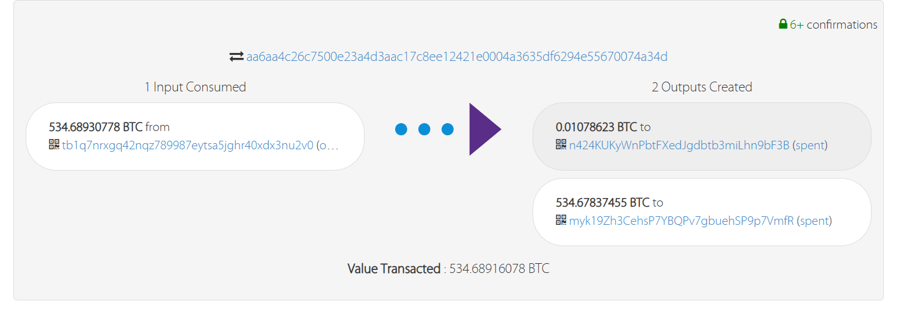
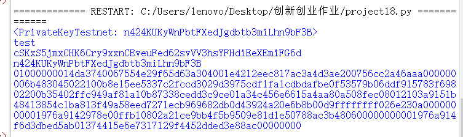
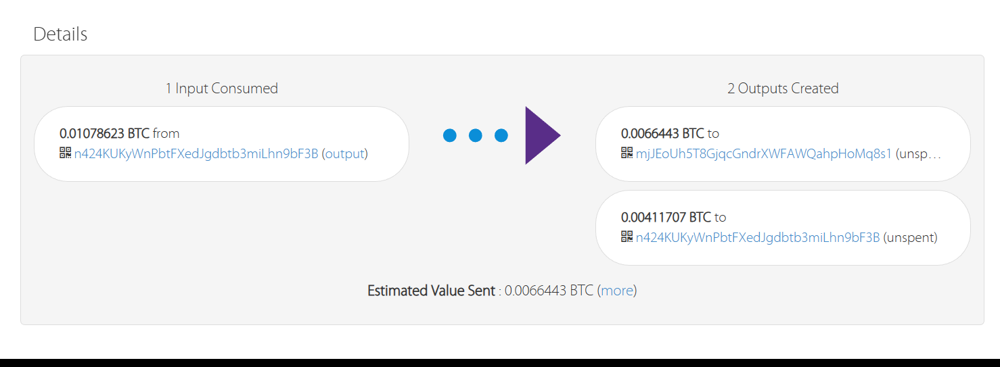

> ## 地址生成
> 打开网站 https://www.bitaddress.org/ ， 并在网站打开后在网址后面加上?testnet=True，进入生成比特币测试网地址的网站。之后，按照网站的要求随意移动鼠标后即可生成合法的地址。\
> 生成的地址如下：n424KUKyWnPbtFXedJgdbtb3miLhn9bF3B

>
> 
>
>## 获取比特币
>可以从一些水龙头网站获取免费的测试网的比特币。这里我选择的网站是https://coinfaucet.eu/en/btc-testnet/ 。
>
>
>
>## 查看交易
> 在比特币测试网浏览器https://live.blockcypher.com/btc-testnet/ 上，我们可以通过输入地址来查询历史的交易记录。\
> 通过下图我们可以看出刚才水龙头网站的地址给我的地址转了0.01078623个比特币。
>
>
>## 生成交易
>这里我们选择使用python中的bit库，来生产交易的信息。\
>在这个库里，它可以通过一个地址的私钥来创建一个类存储这个地址，即代码中的my_key = PrivateKeyTestnet('cSKxS5jmxCHK6Cry9xxnCEveuFed62svVV3hsYFHdiEeXEmiFG6d')\
>之后我们再用PrivateKeyTestnet的方法create_transaction来创建一个交易，并打印出该交易的信息。这个方法只需要我们输入接收地址，发送币的数量和币的种类即可。\
>
>代码如下：
>   ```python
>    from bit import PrivateKeyTestnet
     my_key = PrivateKeyTestnet('cSKxS5jmxCHK6Cry9xxnCEveuFed62svVV3hsYFHdiEeXEmiFG6d')
     print(my_key.version)
     print(my_key.to_wif())
     print(my_key.address)
     print(my_key.create_transaction([('mjJEoUh5T8GjqcGndrXWFAWQahpHoMq8s1', 0.0000001, 'usd')]))

> 生成的交易信息如下：01000000014da3740067554e29f65d63a304001e4212eec817ac3a4d3ae200756cc2a46aaa000000006b483045022100b8e15ee5337c2fccd3029d3975cdf1fa1cdbdafbe0f53579b06ddf915783f69802200b35402ffc949af81a10b87338cedd3c9ce01a34c456e6615a4aa80a508fec08012103a9151b48413854c1ba813f49a58eed7271ecb969682db0d43924a20e6b8b00d9ffffffff026e230a00000000001976a9142978e00ffb10802a21ce9bb4f5b9509e81d1e50788ac3b480600000000001976a914f6d3dbed5ab01374415e6e7317129f4452dded3e88ac00000000
> 
>
> ## 广播交易
> 最后我们只需要返回刚才的比特币浏览器，在上面广播我们的交易信息即可。
> 交易信息如下：\
> 
>
>  ```python
    {
    "block_hash": "000000000000003db394e32f9902f09c78a669cb4a86b6774dd84066748a5b2b",
    "block_height": 2470259,
    "block_index": 15,
    "hash": "b16c44d0f336cce1dcfb39c53fee6eb22570e3f490eb6c08447ce706c5b2259d",
    "hex": "01000000014da3740067554e29f65d63a304001e4212eec817ac3a4d3ae200756cc2a46aaa000000006b483045022100b8e15ee5337c2fccd3029d3975cdf1fa1cdbdafbe0f53579b06ddf915783f69802200b35402ffc949af81a10b87338cedd3c9ce01a34c456e6615a4aa80a508fec08012103a9151b48413854c1ba813f49a58eed7271ecb969682db0d43924a20e6b8b00d9ffffffff026e230a00000000001976a9142978e00ffb10802a21ce9bb4f5b9509e81d1e50788ac3b480600000000001976a914f6d3dbed5ab01374415e6e7317129f4452dded3e88ac00000000",
    "addresses": [
        "mjJEoUh5T8GjqcGndrXWFAWQahpHoMq8s1",
        "n424KUKyWnPbtFXedJgdbtb3miLhn9bF3B"
    ],
    "total": 1076137,
    "fees": 2486,
    "size": 226,
    "vsize": 226,
    "preference": "low",
    "relayed_by": "3.237.192.153",
    "confirmed": "2023-08-01T16:08:59Z",
    "received": "2023-08-01T16:01:20.286Z",
    "ver": 1,
    "double_spend": false,
    "vin_sz": 1,
    "vout_sz": 2,
    "confirmations": 83,
    "confidence": 1,
    "inputs": [
        {
            "prev_hash": "aa6aa4c26c7500e23a4d3aac17c8ee12421e0004a3635df6294e55670074a34d",
            "output_index": 0,
            "script": "483045022100b8e15ee5337c2fccd3029d3975cdf1fa1cdbdafbe0f53579b06ddf915783f69802200b35402ffc949af81a10b87338cedd3c9ce01a34c456e6615a4aa80a508fec08012103a9151b48413854c1ba813f49a58eed7271ecb969682db0d43924a20e6b8b00d9",
            "output_value": 1078623,
            "sequence": 4294967295,
            "addresses": [
                "n424KUKyWnPbtFXedJgdbtb3miLhn9bF3B"
            ],
            "script_type": "pay-to-pubkey-hash",
            "age": 2470196
        }
    ],
    "outputs": [
        {
            "value": 664430,
            "script": "76a9142978e00ffb10802a21ce9bb4f5b9509e81d1e50788ac",
            "addresses": [
                "mjJEoUh5T8GjqcGndrXWFAWQahpHoMq8s1"
            ],
            "script_type": "pay-to-pubkey-hash"
        },
        {
            "value": 411707,
            "script": "76a914f6d3dbed5ab01374415e6e7317129f4452dded3e88ac",
            "addresses": [
                "n424KUKyWnPbtFXedJgdbtb3miLhn9bF3B"
            ],
            "script_type": "pay-to-pubkey-hash"
        }
    ]
}

>## 交易信息分析
> 
