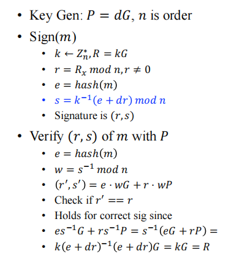
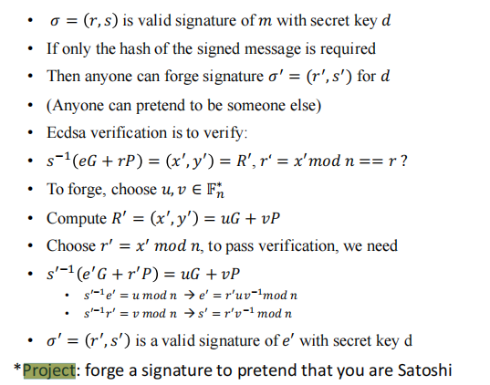
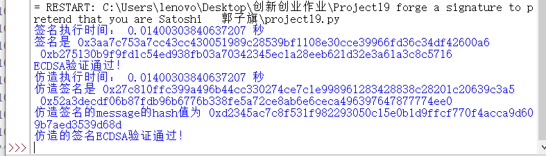
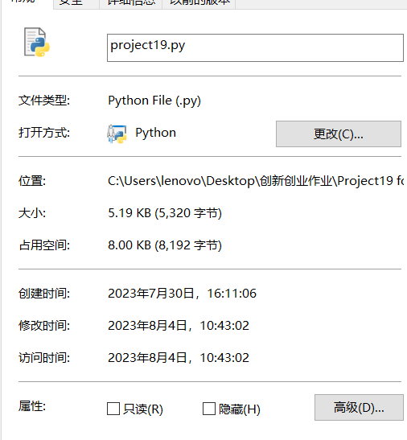

## 原理阐述
>ECDSA签名和验证算法的流程如下图：
>
 >

 >根据一对合法签名仿造一对签名的原理如下。简单来说就是随机选取u和v来生成新的R，并根据新的R还有原来的签名，模拟出一个合法签名。原理图如下：
>
> 
>
## 代码实现
椭圆曲线的加法和乘法，代码如下：

```python:
#椭圆曲线上点的加法P和Q是要相加的两个点，p是素数p，a是曲线参数A返回相加后的点R
def point_addition(P, Q, p, a):
    if P is None:
        return Q
    if Q is None:
        return P
    if P[0] == Q[0] and P[1] != Q[1]:
        return None
    if P != Q:
        lam = ((Q[1] - P[1]) * inverse_mod(Q[0] - P[0], p)) % p
    else:
        lam = ((3 * P[0]**2 + a) * inverse_mod(2 * P[1], p)) % p
    x = (lam**2 - P[0] - Q[0]) % p
    y = (lam * (P[0] - x) - P[1]) % p
    return (x, y)

#对点P进行k倍的标量乘法k: 标量（整数）P: 要乘的点（点的坐标(x, y)）
#p: 素数p a: 曲线参数A  返回：标量乘法后的点坐标
def point_multiplication(k, P, p, a):
    R = None
    for i in range(k.bit_length()):
        if k & (1 << i):
            R = point_addition(R, P, p, a)
        P = point_addition(P, P, p, a)
    return R
```
ECDSA签名函数，只需要按照图片中给定的步骤一步一步实现即可：
```Python:
def sign_message(private_key, message):
    # 从私钥派生公钥
    public_key = point_multiplication(private_key, (Gx, Gy), p, A)
    
    # 将消息哈希为一个大整数
    hashed_message = int(hashlib.sha256(message.encode('utf-8')).hexdigest(), 16)
    
    # 生成随机数k，并计算签名组件r和s
    k = 1
    while k == 1:
        k = random.randrange(1, n)
    r, y = point_multiplication(k, (Gx, Gy), p, A)
    s = (inverse_mod(k, n) * (hashed_message + private_key * r)) % n
    
    return (r, s)
```
ECDSA验证函数，只需要按照图片中给定的步骤一步一步实现即可：
```python:
def verify_signature(public_key, signature, message,ifforge):
    """
    验证签名是否有效
    public_key: 公钥（点的坐标(x, y)）
    signature: 签名（r, s）
    message: 要验证的消息（字符串）
    返回：True表示验证通过，False表示验证失败
    """
    r, s = signature
    if ifforge==0:
        # 将消息哈希为一个大整数
        hashed_message = int(hashlib.sha256(message.encode('utf-8')).hexdigest(), 16)
    else:
        hashed_message = message
    # 计算s的逆
    s_inv = inverse_mod(s, n)
    
    # 计算u1和u2
    u1 = (hashed_message * s_inv) % n
    u2 = (r * s_inv) % n
    
    # 计算点(u1*G + u2*public_key)的坐标
    x, y = point_addition(point_multiplication(u1, (Gx, Gy), p, A),
                          point_multiplication(u2, public_key, p, A),
                          p, A)
    
    # 验证签名是否有效
    return r == x

```

密钥对生成函数，就随机选个数字k，计算kG即可。代码如下：
```python:
#随机生成一对公钥和私钥  返回：(private_key, public_key) 公钥和私钥的组合
def generate_key_pair():
    private_key = random.randrange(1, n)
    public_key = point_multiplication(private_key, (Gx, Gy), p, A)
    return private_key, public_key
```

伪造函数，这一步也只需要按照图片的的步骤一步一步实现即可，没有什么特殊的点：
``` python:
#伪造签名的函数  signature:伪造需要的一个合法签名
def forge_signature(signature,public_key):
    u = random.randrange(1, n)
    v = random.randrange(1, n)
    R1=point_addition(point_multiplication(u, (Gx, Gy), p, A),
                          point_multiplication(v, public_key, p, A),
                          p, A)
    r1 , _ = R1;
    r1 = r1 % n
    e1 = (r1 * u * inverse_mod(v, n)) % n
    s1 = (r1 * inverse_mod(v, n)) % n
    return ((r1,s1),e1)
```

## 结果展示
 

 ## 文件时间
 


