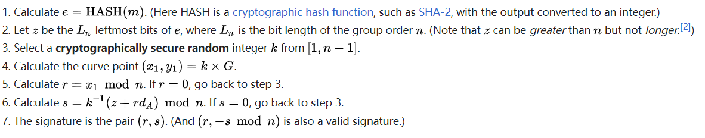
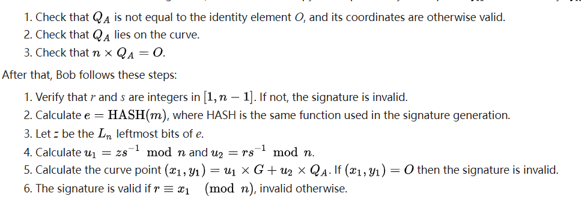
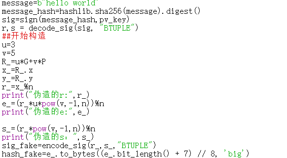

## ECDSA
In cryptography, the Elliptic Curve Digital Signature Algorithm (ECDSA) offers a variant of the Digital Signature Algorithm (DSA) which uses elliptic-curve cryptography.
### sign
#### 实现流程

#### 对应代码实现

### verify
#### 实现流程

#### 对应代码实现

### attack
#### 实现流程

#### 对应代码实现

#### 结果展示

观察构造方式可知，该伪造是基于构造签名结果R，反过来确定参数e和s。实现的是(e,(r,s))的伪造，仍无法实现(m,(r,s))的伪造。

