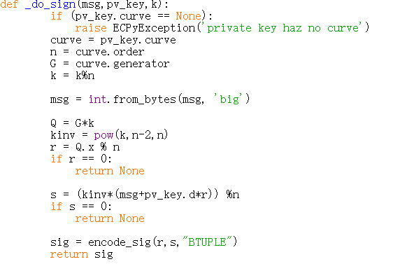
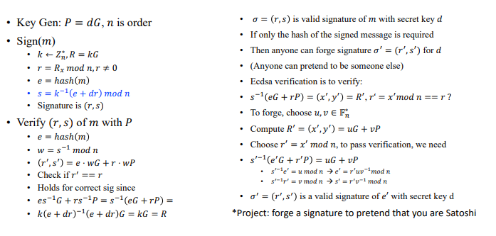
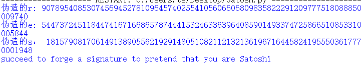

## ECDSA
In cryptography, the Elliptic Curve Digital Signature Algorithm (ECDSA) offers a variant of the Digital Signature Algorithm (DSA) which uses elliptic-curve cryptography.
### sign
#### 实现流程

#### 对应代码实现

### verify
#### 实现流程

#### 对应代码实现

### attack
#### 实现流程

#### 对应代码实现

