


> ## 原理阐释
> 生日问题也叫做生日悖论，它是这样这样描述的。假如随机选择n个人，那么这个n个人中有两个人的生日相同的概率是多少。如果要想概率是100%，那么只需要选择367个人就够了。因为只有366个生日日期（包括2月29日）。如果想要概率达到99.9% ，那么只需要70个人就够了。50%的概率只需要23个人。更直观地，我们可以看一下两幅图片。
>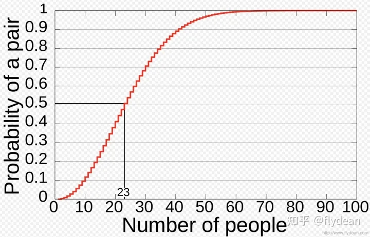
>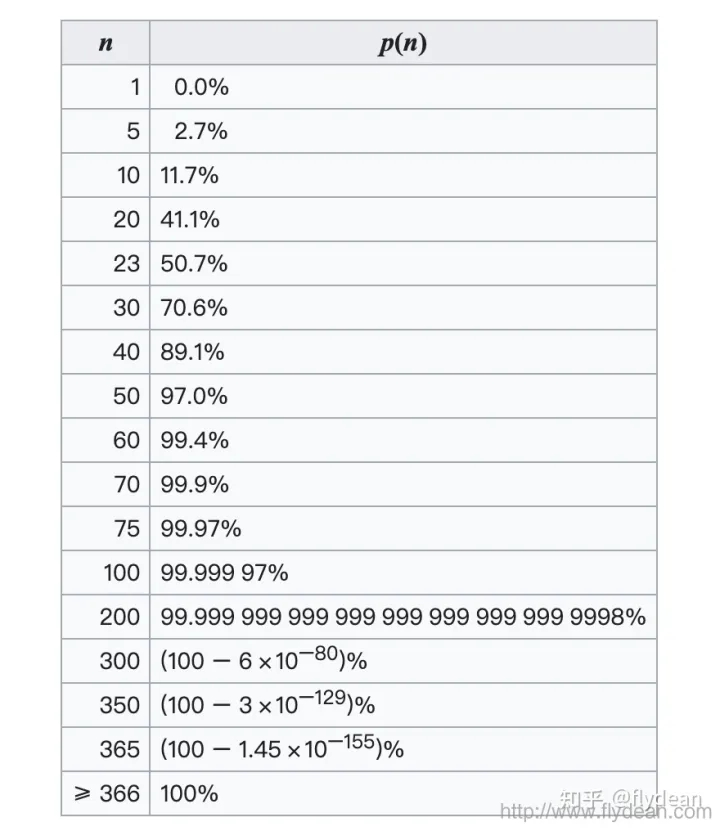
> 而在密码学中，我们可以利用生日悖论，构造哈希碰撞。使得哈希碰撞的复杂度由pow(2,n)变成pow（2，n/2），这使得寻找哈希碰撞成为可能。
> ## 代码说明
> 我们已经使用c++代码完成了SM3的实现。但是，考虑到攻击的方便性，我们本次实验使用python的gmssl库完成SM3的生日碰撞攻击的实现。并且，通过引入python的hashlib库完成sha256的生日碰撞攻击地实现来进行相应的对照。具体代码细节实现如下：
> 
>    ```python
>     def collision_SHA256(num):
        for item in permutations(ts,5):
            item=''.join(item)
            item=item.encode()
            hash_object = hashlib.sha256(item)
            hex_digest = hash_object.hexdigest()
            value=hex_digest[0:num]
            if(value not in st):
                st[value]=(item,1)
            else:
                print(st[value][0])
                print(item)
                print(SHA256(st[value][0].decode()))
                print(SHA256(item.decode()))
                break
> 
>```python
>    def collision_SHA256(num):
        for item in permutations(ts,5):
            item=''.join(item)
            item=item.encode()
            hash_object = hashlib.sha256(item)
            hex_digest = hash_object.hexdigest()
            value=hex_digest[0:num]
            if(value not in st):
                st[value]=(item,1)
            else:
                print(st[value][0])
                print(item)
                print(value)
                break

>
>
>观察上述代码可知，我们构造了一个由数字和字符组成的字符串，然后通过该字符串生成固定长度为5的字符串。通过遍历固定长度为5的字符串，一定程度上简化了程序的复杂性，而不丧失其正确性。我们通过建立哈希表来存储已经进行计算过的字符串，并通过not in 来检查是否发生了reduced 哈希碰撞。这样虽然使得时间复杂度由pow(2,n)降至pow(2,n/2),但是也将空间复杂度由常数变成了pow(2,n).由此来看，生日攻击属于一种空间换取时间的算法。


>## 结果展示
>8bits
>
>
>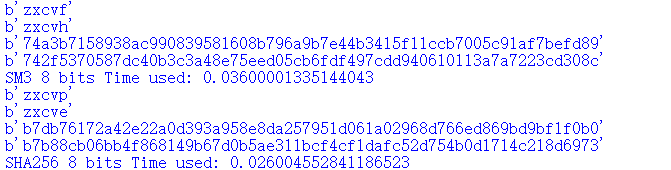
>
>
>16bits
>
>
>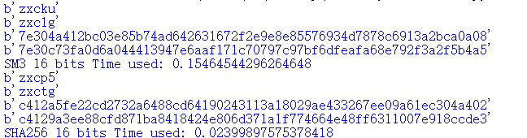
>
>
>24bits
>
>
>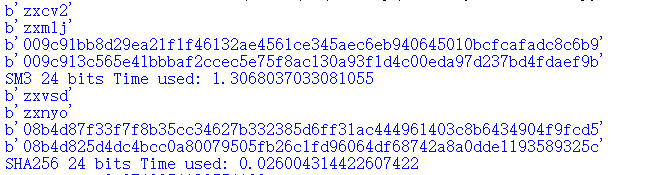
>
>
>32bits
>
>
>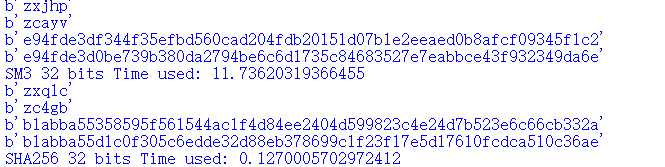
>
>
>40bits
>
>
>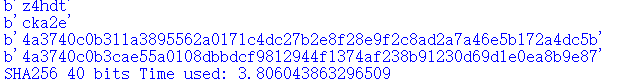
>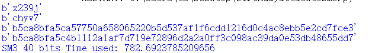
>
>
>44bits
>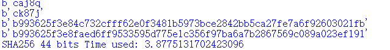
>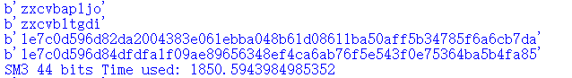
>
>
>48bits
>
>
>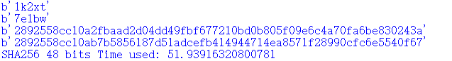
>
>
>52bits
>
>
>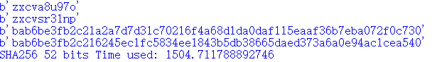
>
>


>|        | 8bits  | 16bits | 24bits | 32bits | 40bits |44bits |48bits |52bits |
>|--------|--------|--------|--------|--------|--------|-------|-------|-------|
>| SM3    | 0.036s | 0.154s | 1.307s | 11.736s|782.692s|1850.594|       |       |
>| SHA256 | 0.026s | 0.024s | 0.026s | 0.127s | 3.806s |3.877s |51.939s|1504.711|
>
>
>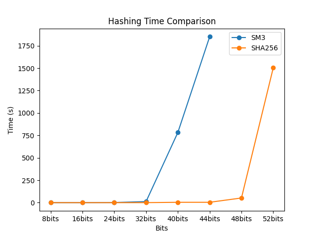


