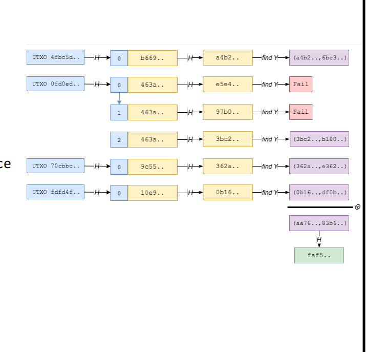
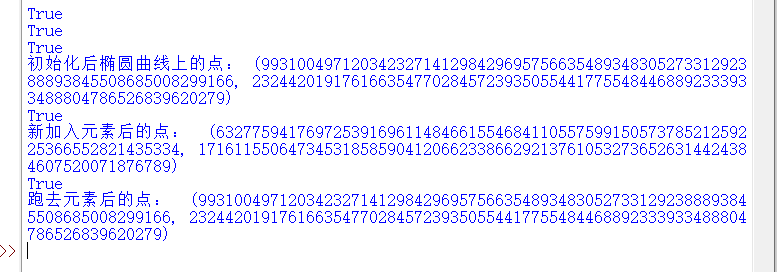
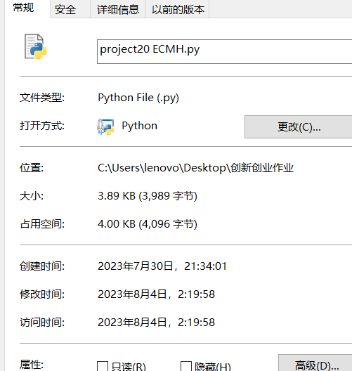

## 原理阐述
在比特网交易时，又是不用差全部的历史交易记录，只需要查近期的UTXO即可。\
而在比特币交易过程中，为了防止有人伪造UTXO，我们需要对UTXO列表进行一次摘要，把摘要在全网公布。而如果计算摘要只是使用传同的hash加和函数，会有很多安全隐患：\
第一，假设当前UTXO集合哈希为S，我想伪造的交易为T，那么我只需要找到另外哈希值为S-T的交易即可。\
第二，hash加和我并不知道里头元素的个数，会造成一个摘要对应很多种UTXO列表排列组合的情况，严重影响安全。\
为了解决这些安全隐患，就有人提出了ECMH算法。这个算法简单来说就是先对UTXO列表中的每个元素求hash，然后再把该hash转化到椭圆曲线的点上，再对椭圆曲线的点作家和操作。而其比hash求和跟安全的基本原理就是，ECMH算法需要的密钥长短远远小于哈希求和算法。
 

 ## 代码实现
 椭圆曲线的加法和点乘：
 ```python
#椭圆曲线上点的加法P和Q是要相加的两个点，p是素数p，a是曲线参数A返回相加后的点R
def point_addition(P, Q, p, a):
    if P is None:
        return Q
    if Q is None:
        return P
    if P[0] == Q[0] and P[1] != Q[1]:
        return None
    if P != Q:
        lam = ((Q[1] - P[1]) * inverse_mod(Q[0] - P[0], p)) % p
    else:
        lam = ((3 * P[0]**2 + a) * inverse_mod(2 * P[1], p)) % p
    x = (lam**2 - P[0] - Q[0]) % p
    y = (lam * (P[0] - x) - P[1]) % p
    return (x, y)

def point_subtraction(P, Q, p, a):
    # 计算点 Q 的负元素 -Q
    if Q is None:
        return P
    Q_negative = (Q[0], (-Q[1]) % p)

    # 使用点加法函数计算 P - Q
    result = point_addition(P, Q_negative, p, a)

    return result
#对点P进行k倍的标量乘法k: 标量（整数）P: 要乘的点（点的坐标(x, y)）
#p: 素数p a: 曲线参数A  返回：标量乘法后的点坐标
def point_multiplication(k, P, p, a):
    R = None
    for i in range(k.bit_length()):
        if k & (1 << i):
            R = point_addition(R, P, p, a)
        P = point_addition(P, P, p, a)
    return R
```

对某点是否再椭圆曲线上进行判断的函数，只需要将x带入表达式判断是否与y相等即可。代码如下：
```python
#判断点 (x, y) 是否在椭圆曲线 y^2 = x^3 + ax + b 上
def is_point_on_elliptic_curve(x, y):
    left_side = (y**2) % p
    right_side = (x**3 + A*x + B) % p
    return left_side == right_side
```

将某一个UTXO转化为椭圆曲线上的一点。我们首先对该UTXO进行hash，把hash后的值当成x值，带入椭圆曲线的表达式中得到y。若计算出的点再椭圆曲线上，则该点为转化后的点，若不在，则对刚才hash过的值继续hash，重复上述步骤，智斗某一点再椭圆曲线上。代码如下：
```python
#将一个字符串转化成椭圆曲线上的点
def hash_to_point(message):
    hashed_message=message
    # 计算消息的哈希值
    i=0
    while(True):
        i=i+1
        if(i%100000==0):
            print(i)
        hashed_message = sm3(hashed_message)
         
        # 将哈希值的前半部分和后半部分分别作为 x 和 y 坐标
        x = int.from_bytes(hashed_message, byteorder='big')
        y = calculate_y_coordinate(x)


        if is_point_on_elliptic_curve(x,y):
            print(is_point_on_elliptic_curve(x,y))
            return (x,y)
```
EMCH里有关UTXO列表的一些基础函数，初始化、加入新元素，抛去老元素。代码如下;
```python
def UTXOinit(UTXOlist):
    middle=hash_to_point(UTXOlist[0])
    for i in UTXOlist[1:]:
        middle=point_addition(middle,hash_to_point(i),p,A)
    return middle

def UTXOadd(hello,UTXO):
    return point_addition(UTXO,hash_to_point(hello),p,A)

def UTXOsub(hello,UTXO):
    return point_subtraction(UTXO,hash_to_point(hello),p,A)
```

## 结果展示
 

 ## 文件时间
  
