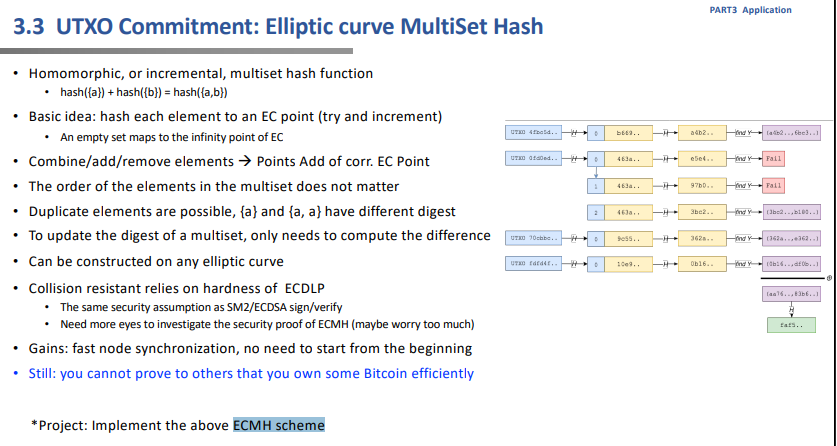
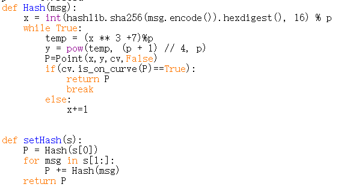
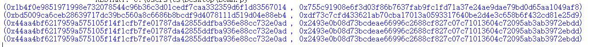

## 概念阐释
ECMH（Elliptic Curve Multiset Hash）是一种 hash 算法，它的特点是可以把多个数据的 hash 合并到一个 hash 中，但还可以支持删除。这样节点维护一个 UTXO 的根 hash 的成本就很低了，每次只需做增量修改。然后只需要把 UTXO 根 hash 记录到区块上，其他节点同步 UTXO 集合之后，就可以验证该集合是否被篡改了。
## 实现思路
将交易信息的hash值与椭圆曲线上的点完成映射关系。  
信息的集合对应于点的集合。  
信息的运算对应于点的运算。  
## 实现流程

## 对应代码实现

#### 结果展示

观察结果可知：  
The order of the elements in the multiset does not matter.  
Duplicate elements are possible, {a} and {a, a} have different digest.

