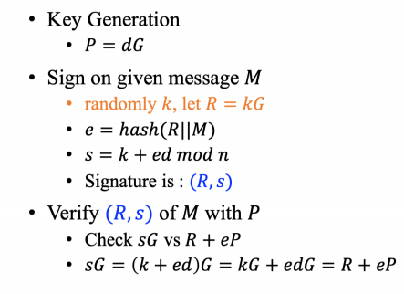
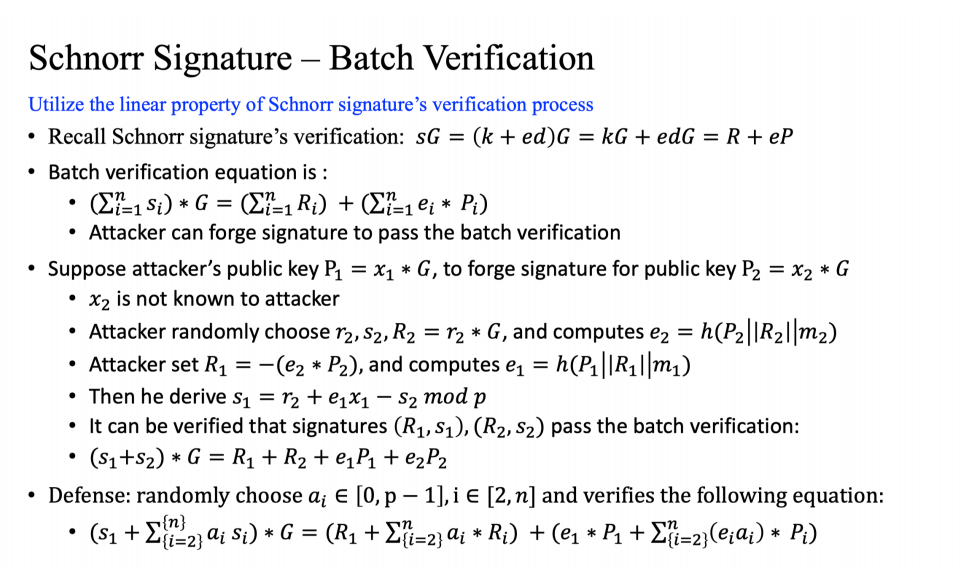
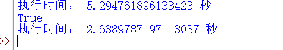
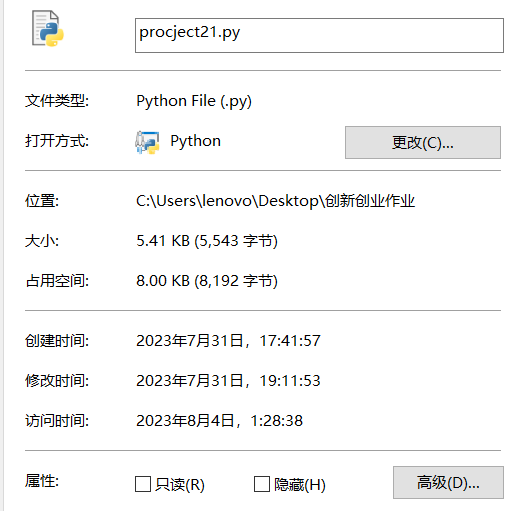

## 原理阐述
Schnorr签名的步骤如下图及原理所示：


Schnorr批量签名验证的步骤如下图及原理所示：

简单来说Schnorr批量签名验证就是利用了常数的加减法速度要远远快于椭圆曲线域上的加减法这一特性，来先将可以提取出来的常数s加和，以实现批量签名验证的加速。

## 代码实现
椭圆曲线上的加法和点乘实现：
```python
#椭圆曲线上点的加法P和Q是要相加的两个点，p是素数p，a是曲线参数A返回相加后的点R
def point_addition(P, Q, p, a):
    if P is None:
        return Q
    if Q is None:
        return P
    if P[0] == Q[0] and P[1] != Q[1]:
        return None
    if P != Q:
        lam = ((Q[1] - P[1]) * inverse_mod(Q[0] - P[0], p)) % p
    else:
        lam = ((3 * P[0]**2 + a) * inverse_mod(2 * P[1], p)) % p
    x = (lam**2 - P[0] - Q[0]) % p
    y = (lam * (P[0] - x) - P[1]) % p
    return (x, y)

def point_subtraction(P, Q, p, a):
    # 计算点 Q 的负元素 -Q
    if Q is None:
        return P
    Q_negative = (Q[0], (-Q[1]) % p)

    # 使用点加法函数计算 P - Q
    result = point_addition(P, Q_negative, p, a)

    return result
#对点P进行k倍的标量乘法k: 标量（整数）P: 要乘的点（点的坐标(x, y)）
#p: 素数p a: 曲线参数A  返回：标量乘法后的点坐标
def point_multiplication(k, P, p, a):
    R = None
    for i in range(k.bit_length()):
        if k & (1 << i):
            R = point_addition(R, P, p, a)
        P = point_addition(P, P, p, a)
    return R
```
密钥生成函数,就是随机生成一个数，再用这个数点乘G点即可，代码如下：
```python
#随机生成一对公钥和私钥  返回：(private_key, public_key) 公钥和私钥的组合
def generate_key_pair():
    private_key = random.randrange(1, n)
    public_key = point_multiplication(private_key, (Gx, Gy), p, A)
    return private_key, public_key
```
Schnorr签名和验证函数，按照上面图片的步骤一步一步实现，即可。代码如下：
```python
#Schnorr Signature签名函数
def sign_message(message,private_key):
    
    # 生成随机数k
    k = 1
    while k == 1:
        k = random.randrange(1, n)
    x, y = point_multiplication(k, (Gx, Gy), p, A)
    # 将消息哈希为一个大整数
    e = int.from_bytes(sm3((hex(x)[2:]+hex(y)[2:]+message).encode('utf-8')), byteorder='big')

    #签署消息
    s = (k + e * private_key) % n
    
    return ((x,y), s)

#签名验证函数
def verify_message(public_key,signature,message):
    (x,y),s=signature
     # 将消息哈希为一个大整数
    e = int.from_bytes(sm3((hex(x)[2:]+hex(y)[2:]+message).encode('utf-8')), byteorder='big')
    if point_multiplication(s, (Gx, Gy), p, A)==point_addition((x,y),point_multiplication(e, public_key, p, A),p,A):
        return True
    else:
        return False
```
批量验证函数，个人认为最大的区别就是xian用常数加法计算了s后再进行点乘。代码如下：
```python
def batch_verify(public_key,signature,message):
    number=len(message)
    left = None
    right = None
    R = None
    ep = None
    e = 0
    s = 0
    for i in range(number):
        e = int.from_bytes(sm3((hex(signature[i][0][0])[2:]+hex(signature[i][0][1])[2:]+message[i]).encode('utf-8')), byteorder='big')
        s = s + signature[i][1]
        R = point_addition(R, signature[i][0], p, A)
        ep = point_addition(ep ,point_multiplication(e, public_key[i], p, A),p,A)
    left = point_addition(left, point_multiplication(s, (Gx, Gy), p, A), p, A)
    right = point_addition(R ,ep,p,A)
    if left==right :
        return True
    else:
        return False
```

## 结果展示
下面的实验结果说明了在我这种简易的椭圆曲线代码实现下，批量验证的速度能比一个一个验证快两倍。


## 文件时间

