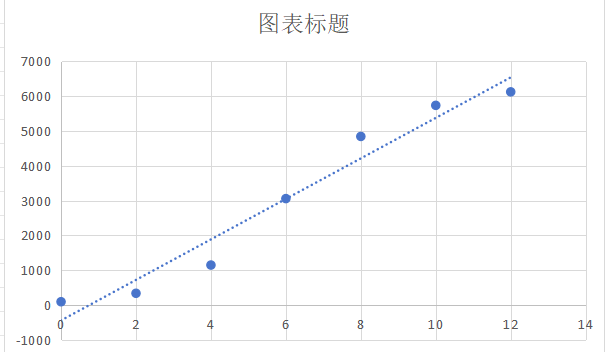

## Schnorr
In cryptography, a Schnorr signature is a digital signature produced by the Schnorr signature algorithm that was described by Claus Schnorr. It is a digital signature scheme known for its simplicity, among the first whose security is based on the intractability of certain discrete logarithm problems. It is efficient and generates short signatures.[1] It was covered by U.S. Patent 4,995,082 which expired in February 2008.
### sign
#### 实现流程

#### 对应代码实现

### verify
#### 实现流程

#### 对应代码实现

### batch verification
#### 实现流程

#### 对应代码实现

#### 速度展示
 

