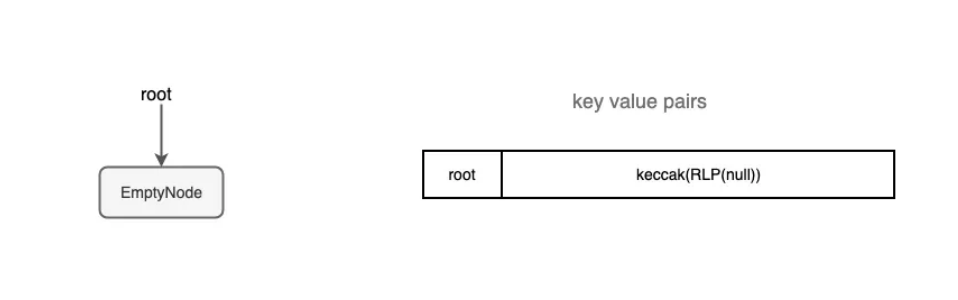
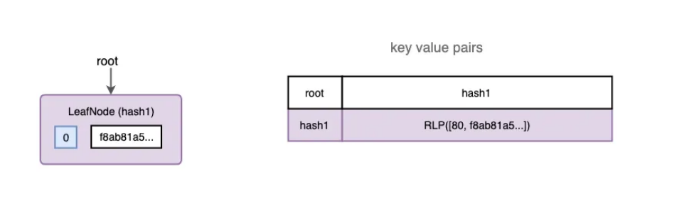
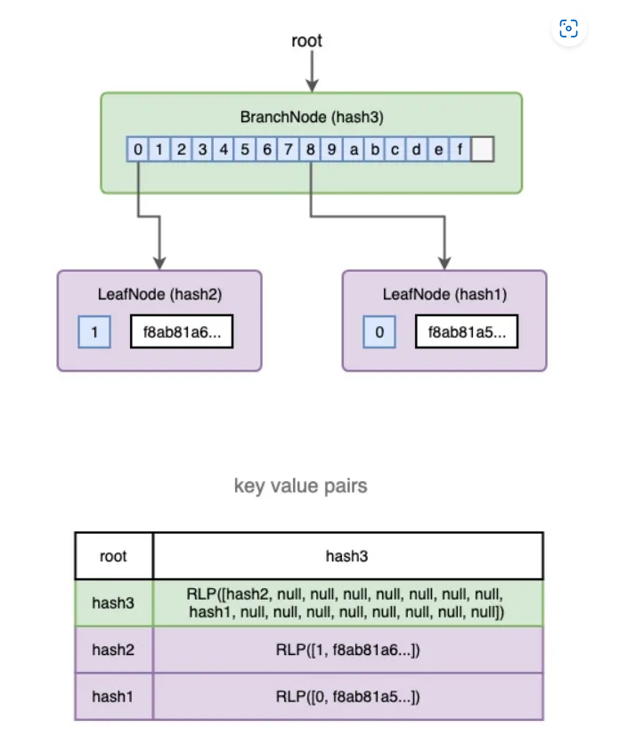
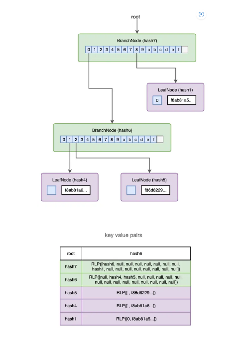
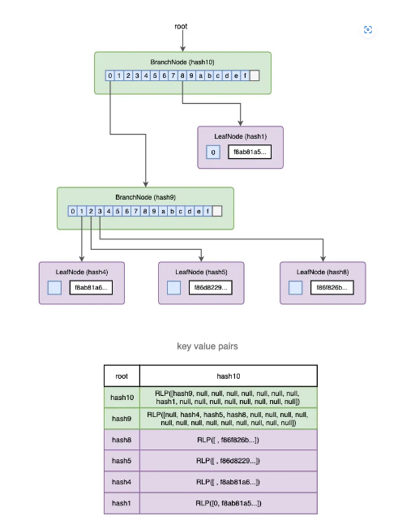

# 什么是MPT？
Patricia Merkle Tries combine a radix trie with a Merkle tree to store key-value pairs and verify data integrity, ideal for editing and storing ephemeral data.
## 什么是 Patricia?
P = Practical  
A = Algorithm  
T = To  
R = Retrieve  
I = Information  
C = Coded  
I = In  
A = Alphanumeric  
### 为什么需要MPT？  
There are typically two different types of data:
Permanent
Once a transaction occurs, that record is sealed forever.
This means that once you locate a transaction in a block’s transaction trie, you can return to the same path over and over to retrieve the same result
Ephemeral
In the case of Ethereum, account states change all the time! (ie. A user receives some ether, interacts with a contract, etc)
nonce, balance, storageRoot, codeHash
It makes sense that permanent data, like mined transactions, and ephemeral data, like Ethereum accounts (balance, nonce, etc), should be stored separately. Merkle trees, again, are perfect for permanent data. PMTs are perfect for ephemeral data, which Ethereum is in plenty supply of.
Unlike transaction history, Ethereum account state needs to be frequently updated. The balance and nonce of accounts is often changed, and what’s more, new accounts are frequently inserted, and keys in storage are frequently inserted and deleted.
# MPT的前世
## Radix trie  
### 什么是radix trie?
Trie树，又称前缀树或字典树，是一种有序树，用于保存关联数组。其中的键通常是字符串。与二叉查找树不同，键不是直接保存在节点中，而是由节点在树中的位置决定 。一个节点的所有子孙都有相同的前缀，也就是这个节点对应的字符串，而 根节点对应空字符串。
### radix trie 优势
相比于哈希表，使用前缀树来进行查询拥有共同前缀key的数据时十分高效，例如在字典中查找前缀为pre的单词，对于哈希表来说，需要遍历整个表，时间效率为O(n)，然而对于前缀树来说，只需要在树中找到前缀为pre的节点，且遍历以这个节点为根节点的子树即可。  

##  Patricia trie
### 什么是patricia trie?
一种更节省空间的Trie。对于基数树的每个节点，如果该节点是唯一的儿子的话，就和父节点合并。

## Merkle tree
### 什么是merkle tree?
Merkle tree是一种树，大多数是二叉树，也可以多叉树，无论是几叉树，它都具有树结构的所有特点；Merkle tree叶子节点的value是数据项的内容，或者是数据项的哈希值；非叶子节点的value根据其孩子节点的信息，然后按照Hash算法计算而得出的；
### merkle tree优势
#### 快速重哈希
Merkle tree的特点之一就是当树节点内容发生变化时，能够在前一次哈希计算的基础上，仅仅将被修改的树节点进行哈希重计算，便能得到一个新的根哈希用来代表整棵树的状态。
#### 轻节点扩展
采用Merkle tree，可以在公链环境下扩展一种“轻节点”。轻节点的特点是对于每个区块，仅仅需要存储约80个字节大小的区块头数据，而不存储交易列表，回执列表等数据。

# MPT的工作原理原理
## 基本键值映射
>type Trie interface {  
>  // methods as a basic key-value mapping  
>  Get(key []byte) ([]byte, bool) {  
>  Put(key []byte, value []byte)  
>  Del(key []byte, value []byte) bool  
> }
## 验证数据完整性  
> type Trie interface {  
> // compute the merkle root hash for verifying data integrity  
>  Hash() []byte  
>}
## 验证是否包含键值对
> type Proof interface {}  
>  
>type Trie interface {  
> // generate a merkle proof for a key-value pair for verifying the inclusion of the key-value pair  
> Prove(key []byte) (Proof, bool)  
>}  
>// verify the proof for the given key with the given merkle root hash  
>func VerifyProof(rootHash []byte, key []byte, proof Proof) (value []byte, err error)  ># 内部构造
trie有4种类型的节点：EmptyNode，LeafNode，BranchNode和ExtensionNode。每个节点将被编码并作为键值对存储在键值存储中。
# 具体实例
## 关键信息阐述
> 主网区块10593417
> 四笔交易
> 交易根哈希：0xab41f886be23cd786d8a69a72b0f988ea72e0b2e03970d0798f5e03763a442cc
> 键值对存储
>>(80, f8ab81a5852e90edd00083012bc294a3bed4e1c75d00fa6f4e5e6922db7261b5e9acd280b844a9059cbb0000000000000000000000008bda8b9823b8490e8cf220dc7b91d97da1c54e250000000000000000000000000000000000000000000000056bc75e2d6310000026a06c89b57113cf7da8aed7911310e03d49be5e40de0bd73af4c9c54726c478691ba056223f039fab98d47c71f84190cf285ce8fc7d9181d6769387e5efd0a970e2e9)
>>(01, f8ab81a6852e90edd00083012bc294a3bed4e1c75d00fa6f4e5e6922db7261b5e9acd280b844a9059cbb0000000000000000000000008bda8b9823b8490e8cf220dc7b91d97da1c54e250000000000000000000000000000000000000000000000056bc75e2d6310000026a0d77c66153a661ecc986611dffda129e14528435ed3fd244c3afb0d434e9fd1c1a05ab202908bf6cbc9f57c595e6ef3229bce80a15cdf67487873e57cc7f5ad7c8a)
>>(02, f86d8229f185199c82cc008252089488e9a2d38e66057e18545ce03b3ae9ce4fc360538702ce7de1537c008025a096e7a1d9683b205f697b4073a3e2f0d0ad42e708f03e899c61ed6a894a7f916aa05da238fbb96d41a4b5ec0338c86cfcb627d0aa8e556f21528e62f31c32f7e672)
>>(03, f86f826b2585199c82cc0083015f9094e955ede0a3dbf651e2891356ecd0509c1edb8d9c8801051fdc4efdc0008025a02190f26e70a82d7f66354a13cda79b6af1aa808db768a787aeb348d425d7d0b3a06a82bd0518bc9b69dc551e20d772a1b06222edfc5d39b6973e4f4dc46ed8b196)
## 图片展示
### 空

### 添加第一个事务

### 添加第二个事务

### 添加第三个事务

### 添加第四个事务

