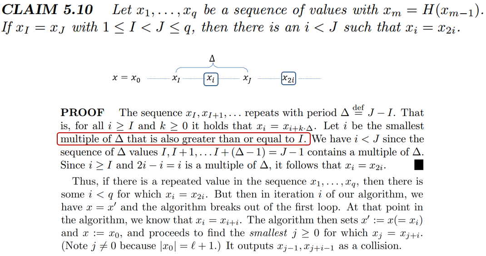
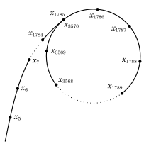
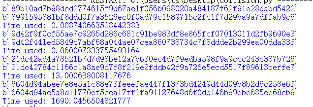

> ## 原理阐释
> Pollard 的 rho 算法是一种用于整数分解的算法，由 John Pollard 在 1975 年提出。该算法通过利用模运算和多项式来生成伪随机序列，并利用循环的结构寻找重复值，从而找到被分解数的重要因子。该算法的核心思想是选择一个起始值，并利用多项式函数生成序列，该序列与另一个序列在模一个未知重要因子的情况下相关。由于序列的可能值是有限的，当序列重复时，可以利用生日悖论推断序列中可能存在的重要因子。通过比较序列中两个不同位置的值，并检查它们是否在模重要因子的情况下相等，可以确定重要因子的倍数。一旦找到这样的倍数，就可以得到重要因子，从而完成整数分解的过程。为了检测序列中的重复值，可以使用 Floyd 的循环查找算法。该算法通过维护两个节点，每次移动一个节点到下一个位置，另一个节点前进两个位置，然后检查它们的差值是否是重要因子的倍数。如果是，则找到了重要因子。这个过程可以反复进行，直到找到所有的重要因子。需要注意的是，在某些情况下，算法可能会失败或得到非整数的除数。这种情况并不常见，但可以通过调整参数或重新运行算法来解决。总之，Pollard 的 rho 算法是一种有效的整数分解算法，它在空间使用上较少，并且其预期运行时间与被分解的合数的最小质因数的平方根成正比。实现原理如下：
>


>Pollard_rho_cycle图如下：
>
>
>
>
>
>但是，用到哈希函数碰撞上，效果应该不如生日碰撞攻击。但是，它的空间复杂度较低，且针对一些具有周期性的hash函数具有良好的寻找碰撞效果。
> ## 代码说明
> 我们已经使用c++代码完成了SM3的实现。但是，考虑到攻击的方便性，我们本次实验使用python的gmssl库完成SM3的碰撞攻击的实现。并且，通过引入python的hashlib库完成sha256的碰撞攻击的实现来进行相应的对照。具体代码细节实现如下：
> 
>    ```python
>    def Rho_SM3(num):
      item=b"202100460120"
      Hash1=SM3(item)
      Hash2=SM3(Hash1)
      while(True):
          if(Hash1[0:num]!=Hash2[0:num]):
              Hash1=SM3(Hash1)
              Hash2=SM3(SM3(Hash2))
          else:
              print(Hash1)
              print(Hash2)
              break
> ``` python
> def Rho_SHA256(num):
      item=b"202100460120"
      Hash1=SHA256(item)
      Hash2=SHA256(Hash1)
      while(True):
          if(Hash1[0:num]!=Hash2[0:num]):
              Hash1=SHA256(Hash1)
              Hash2=SHA256(SHA256(Hash2))
          else:
              print(Hash1)
              print(Hash2)
              break

>
>
>观察上述代码可知,我将自己的学号输入，来作为初始项来寻找碰撞。我们可以看到当碰撞条件不成立时，这样两个hash值分别进行一次和两次的hash，从而形成“龟兔赛跑”之势。


>## 结果展示
>SHA256
>
>
>
>
>
>SM3
>
>
>
>
>24bits
>
>
>32bits
>
>
>40bits
>


>|        | 8bits  | 16bits | 24bits | 32bits | 40bits |
>|--------|--------|--------|--------|--------|--------|
>| SM3    | 0.036s | 0.154s | 1.307s | 11.736s|        |
>| SHA256 | 0.026s | 0.024s | 0.026s | 0.127s | 3.806s |
>
