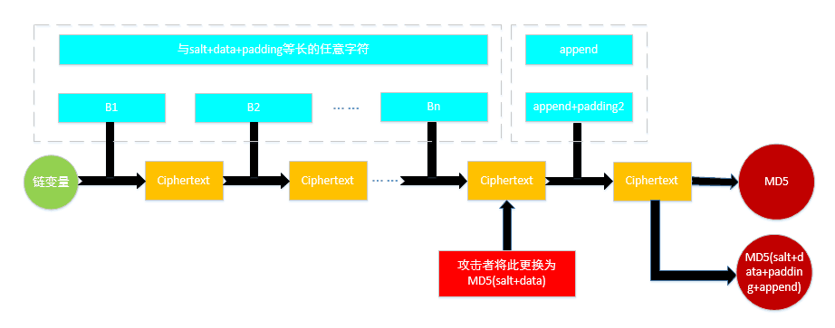
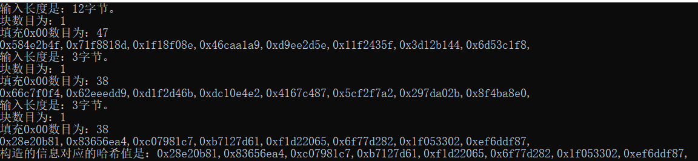

> ## 原理阐释
> 长度扩展攻击（Length Extension Attack）是一种密码学攻击技术，用于破解基于哈希函数的认证与完整性保护机制。它利用了一些哈希函数（如MD5、SHA-1等）在处理消息时存在的漏洞。在正常情况下，哈希函数将输入消息作为输入并生成固定长度的摘要值。然而，在长度扩展攻击中，攻击者能够根据已知的哈希值和消息前缀构造出一个新的哈希值，而不需要知道原始消息内容。攻击的核心思想是通过构造合适的数据块来绕过哈希函数的内部状态更新，并生成有效的哈希扩展，从而让接收者误以为这是一个合法的哈希结果。为了防范长度扩展攻击，应该使用具有内置防护措施的哈希函数，例如HMAC。HMAC将密钥引入哈希计算的过程中，增加了攻击者对数据的控制难度。此外，推荐使用更安全的哈希函数，如SHA-256、SHA-3等，而不是已被证明存在问题的哈希函数，如MD5和SHA-1。总之，长度扩展攻击是一种危险的密码学攻击技术，可被用于欺骗基于哈希函数的认证与完整性保护机制。为了保护数据安全，我们应该使用具有内置防护措施并被广泛接受为安全的哈希函数。实现原理如下：
>
> 
>
>实际上，长度扩展攻击对MD结构有效，而对于海绵体结构无效。同时，长度扩展攻击其实对于哈希函数的威胁性并不大。因为，哈希函数的IV值是已知的，通过构造IV值来实现长度扩展攻击并没有什么意义。但是，长度扩展攻击对于攻击加盐的哈希函数或者伪造MAC值具有一定的效果。
> ## 代码说明
> 我们已经使用c++代码完成了SM3的实现。在此基础之上，我们构建两个字符串，“202100460120”和“abc”，来完成一个实例的具体攻击。具体代码细节实现如下：
> 
>    ```C++
>  int main()
      {
	
	      //length_expand_attack();
	      char s3[100] = "202100460120";
	      uint32_t *jkl=SM3(s3, IV,result).second;//再执行一次SM3，jkl会变的
	      char s4[100] = "abc";
	      SM3(s4, IV,result);
	      SM3(s4, jkl,result);
	      ExpandT(T);
	      uint32_t paddxing[2][16] = { { 0x32303231,0x30303436,0x30313230,0x80000000,0x00000000,0x00000000,
		      0x00000000,0x00000000,0x00000000,0x00000000,0x00000000,0x00000000,0x00000000,0x00000000,0x00000000,0x00000060 },
		      {0x61626380,0x00000000,0x00000000,0x00000000,0x00000000,0x00000000,0x00000000,0x00000000,0x00000000,0x00000000,
		      0x00000000,0x00000000,0x00000000,0x00000000,0x00000000,0x00000018} };
	      uint32_t temp1[8];
	      for (int i = 0;i < 8;i++)
	      {
	      	temp1[i] = IV[i];
	      }
	      uint32_t* temp_ = temp1;

	      for (int i = 0;i < 2;i++)
	      {
	      	ExpandMessage(paddxing[i], W, W_);
		      temp_ = Compress(temp_, W, W_, result);//可修改的左值
		
	      }
	      cout << "构造的信息对应的哈希值是：";
	      Log(result, 8);
	      cin.get();
       }

>
>


>## 结果展示

>
>
>我们看到，最后两行的输出相同。可知，长度扩展攻击成功！
