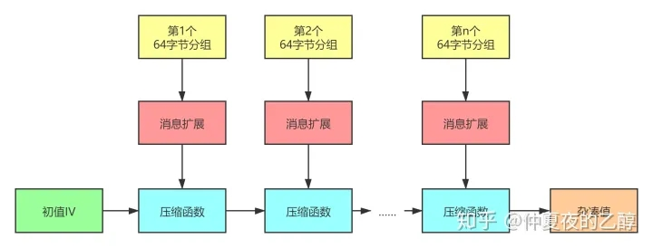

> ## 原理阐释
> SM3密码杂凑算法是中国国家密码管理局2010年公布的中国商用密码杂凑算法标准。该算法于2012年发布为密码行业标准(GM/T 0004-2012)，2016年发布为国家密码杂凑算法标准(GB/T 32905-2016)。SM3适用于商用密码应用中的数字签名和验证，是在SHA-256基础上改进实现的一种算法，其安全性和SHA-256相当。SM3和MD5的迭代过程类似，也采用Merkle-Damgard结构。消息分组长度为512位，摘要值长度为256位。整个算法的执行过程可以概括成四个步骤：消息填充、消息扩展、迭代压缩、输出结果。
> ### 消息填充
> SM3的消息扩展步骤是以512位的数据分组作为输入的。因此，我们需要在一开始就把数据长度填充至512位的倍数。数据填充规则和MD5一样，具体步骤如下：
1、先填充一个“1”，后面加上k个“0”。其中k是满足(n+1+k) mod 512 = 448的最小正整数。
2、追加64位的数据长度（bit为单位，大端序存放。）
>### 消息扩展
> SM3的迭代压缩步骤没有直接使用数据分组进行运算，而是使用这个步骤产生的132个消息字。（一个消息字的长度为32位）概括来说，先将一个512位数据分组划分为16个消息字，并且作为生成的132个消息字的前16个。再用这16个消息字递推生成剩余的116个消息字。
>### 迭代压缩
> 
>
>
>
>
> 
>### 输出结果
> 将得到的A、B、C、D、E、F、G、H八个变量拼接输出，就是SM3算法的输出。
>
> [国家密码管理局关于发布《SM3密码杂凑算法》公告]"https://www.oscca.gov.cn/sca/xxgk/2010-12/17/1002389/files/302a3ada057c4a73830536d03e683110.pdf"
> ## 代码说明
> 我们已经使用c++代码完成了SM3的实现，并且完成了对于代码的优化。由于代码篇幅过长，所以我们仅在下文列出优化部分的代码。
> 
>  __我们注意到每次进行SM3运算都需要提前对常量T进行赋值。所以，我们做出优化：将T直接存储到内存里面，这样就可以查表法直接插取对应的T。这当然也是一种时间换取空间的做法。__
>
>    ```c++
>    void ExpandT(uint32_t* T)
      {
	      for (int i = 0;i < 16;i++)
	      {
		      T[i] = 0x79cc4519;
	      }
	      for (int i = 16;i < 64;i++)
	      {
		      T[i] = 0x7a879d8a;
	      }
>   ```c++
>     uint32_t T[64] = { 0x79cc4519,0x79cc4519,0x79cc4519,0x79cc4519,0x79cc4519,0x79cc4519,0x79cc4519,0x79cc4519,
      0x79cc4519, 0x79cc4519, 0x79cc4519, 0x79cc4519,0x79cc4519, 0x79cc4519, 0x79cc4519 ,0x79cc4519,
      0x7a879d8a ,0x7a879d8a ,0x7a879d8a ,0x7a879d8a,0x7a879d8a ,0x7a879d8a ,0x7a879d8a ,0x7a879d8a,
      0x7a879d8a ,0x7a879d8a ,0x7a879d8a ,0x7a879d8a,0x7a879d8a ,0x7a879d8a ,0x7a879d8a ,0x7a879d8a,
      0x7a879d8a ,0x7a879d8a ,0x7a879d8a ,0x7a879d8a,0x7a879d8a ,0x7a879d8a ,0x7a879d8a ,0x7a879d8a ,
      0x7a879d8a ,0x7a879d8a ,0x7a879d8a ,0x7a879d8a,0x7a879d8a ,0x7a879d8a ,0x7a879d8a ,0x7a879d8a ,
      0x7a879d8a ,0x7a879d8a ,0x7a879d8a ,0x7a879d8a,0x7a879d8a ,0x7a879d8a ,0x7a879d8a ,0x7a879d8a ,
      0x7a879d8a ,0x7a879d8a ,0x7a879d8a ,0x7a879d8a,0x7a879d8a ,0x7a879d8a ,0x7a879d8a ,0x7a879d8a };

> __我们注意到Rotate_left函数实现效率较为低下，执行了大量无意义的运算。因为，我们采用新的编程方式，对于Rotate_left进行一定程度的优化。__
> ``` c++
>  uint32_t buildIntWithKOnes(uint32_t k)
      {
          uint32_t result = 0;
      
          for (int i = 0; i < (32 - k); i++) {
              result |= (1 << i);
          }
          return ~result;
      }

      uint32_t Rotate_left(uint32_t W, uint32_t number)//传值
      {
          uint32_t temp = buildIntWithKOnes(number % 32);
          uint32_t temp_ = ~temp;
          //获得前k比特
          uint32_t temp1 = temp & W;
          uint32_t temp1_ = temp1 >> (32 - number % 32);
          //获得后面比特
          uint32_t temp2 = temp_ & W;
          uint32_t temp2_ = temp2 << number % 32;
      
          uint32_t result = temp1_ | temp2_;
          return result;
      }
      
> ``` c++
> uint32_t Rotate_left(uint32_t value, int shift)
      {
	      if ((shift &= sizeof(value) * 8 - 1) == 0)
		      return value;
	      return (value << shift) | (value >> (sizeof(value) * 8 - shift));
      }

>
>__我们注意到ExpandMessage操作均为for循环操作，所以我们引入了AVX512指令和循环展开技术来实现操作的并行性。__
>``` c++
>void ExpandMessage(uint32_t* paddedResult, uint32_t* W, uint32_t* W_)
      {
          for (int i = 0;i < 16;i++)
          {
              W[i] = paddedResult[i];
          }
          for (int i = 16;i < 68;i++)
          {
              uint32_t temp = W[i - 16] ^ W[i - 9] ^ (Rotate_left(W[i - 3], 15));
              //if (i == 16)cout << hex << temp <<endl;
              uint32_t fake = Rotate_left(W[i - 13], 7);
              //if (i == 16)cout << hex << fake << endl;
              //if (i == 16)cout << hex << P1(temp);
              W[i] = P1(temp) ^ (fake) ^ W[i - 6];
              //if (i == 16)cout <<hex<< W[i];
          }
          for (int i = 0;i < 64;i++)
          {
              W_[i] = (W[i] ^ W[i + 4]);
          }
      }

>```c++
>void ExpandMessage(uint32_t* paddedResult, uint32_t* W, uint32_t* W_)
      {
	      __m512i a = _mm512_load_epi32(paddedResult);
	      _mm512_store_epi32(W, a);
	
	      for (int i = 16;i < 68;i+=2)
	      {
		      uint32_t temp1 = W[i - 16] ^ W[i - 9] ^ (Rotate_left(W[i - 3], 15));
		      uint32_t temp2 = W[i - 15] ^ W[i - 8] ^ (Rotate_left(W[i - 2], 15));
		      uint32_t fake1 = Rotate_left(W[i - 13], 7);
		      uint32_t fake2 = Rotate_left(W[i - 12], 7);
		      W[i] = P1(temp1) ^ (fake1) ^ W[i - 6];
		      W[i + 1] = P1(temp2) ^ (fake2) ^ W[i - 5];
	      }
	      for (int i = 0;i < 64;i+=4)
	      {
		      W_[i] = (W[i] ^ W[i + 4]);
		      W_[i + 1] = (W[i + 1] ^ W[i + 5]);
		      W_[i + 2] = (W[i + 2] ^ W[i + 6]);
		      W_[i + 3] = (W[i + 3] ^ W[i + 7]);
	      }
      }

>## 结果展示
>### 结果的正确性
>
>
>16bits
>
>
>24bits
>
>
>32bits
>
>
>40bits
>


>|        | 8bits  | 16bits | 24bits | 32bits | 40bits |
>|--------|--------|--------|--------|--------|--------|
>| SM3    | 0.036s | 0.154s | 1.307s | 11.736s|        |
>| SHA256 | 0.026s | 0.024s | 0.026s | 0.127s | 3.806s |
>

