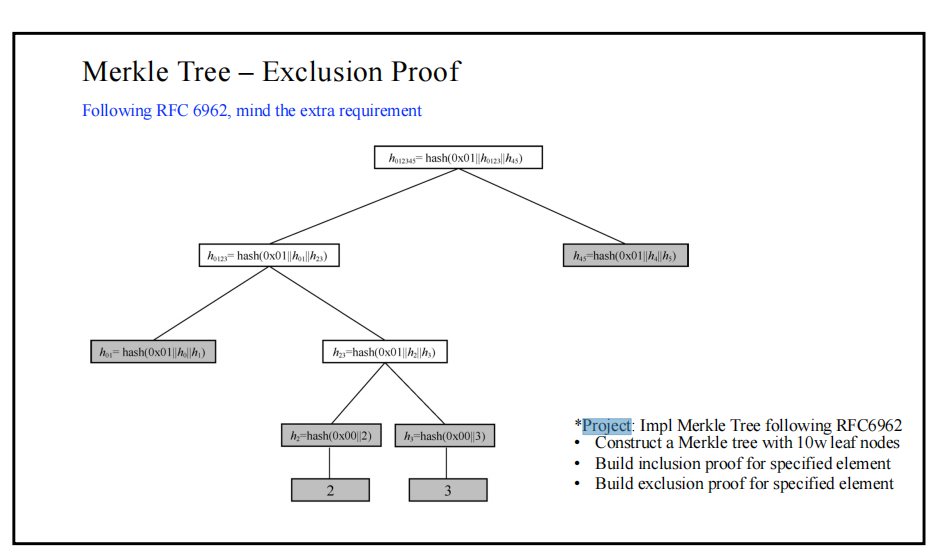
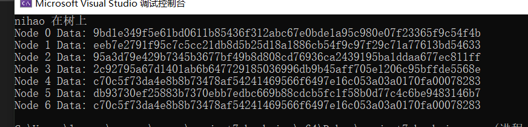

## 原理阐述
Merkle树的核心原理是将大量数据逐层分割，每个数据块通过哈希函数得到唯一的哈希值。然后，这些哈希值再继续合并生成上一层的哈希值，如此递归进行，直到最终形成一个根哈希，称为Merkle根。这样，整个数据集的完整性就可以由Merkle根来代表。\
Merkle树的优势在于，只需存储根哈希值，就可以快速验证数据的完整性。当需要验证某个特定数据块是否正确时，只需沿着Merkle树从叶子节点到根节点的路径计算哈希值，并与存储的Merkle根进行比对，从而验证数据是否被篡改。\
在区块链中，Merkle树被广泛用于确保交易的有效性和区块的完整性。通过将大量交易打包成一个区块，并采用Merkle树结构，可以高效地验证交易数据是否被篡改，从而增强了区块链的安全性和可靠性。\
原理图如下：

 

 ## 代码实现
 我这个project是从project7的需要改变来的，实现的是一个merkle填充数。我的填充规则如下：
 首先，在默克尔树的类中设计一个计数器，记录当前输入叶节点的数量num。之后，当有新的叶节点要加入时，我们只需要把num的二进制数从从左往右变为从右往左（比如说原来是0011，就变为1100），把新的叶节点加入到变化后的num指向的叶节点即可。\
 代码展示：
 ``` cpp
unsigned int Jishu(int number, int length) {
    if (number <= 0) return number;
    int hello = 0;
    for (int middle = length / 2; middle > 0; middle = middle / 2) {
        if ((number & 1) == 1) {
            hello += middle;
        }
        number = number >> 1;
    }
    return hello;
}
```
对于merkle数的实现，我这里就借用完全二叉树的实现。我首先写一个二叉树的实现，在这几处上再进行改变。\
对于构造函数，我把输入的一个字符串（默认为0）作为所有叶节点的值，再根据父=hash（左子+右子）的式子逐步向上更新其他结点的值即可。
```cpp
SMT() {
        Nodenumber = 0;
        Paddednumber = 0;
        depth = 0;
    }
    SMT(int depthin, std::string init) {
        // 初始化树节点
        depth = depthin;
        Paddednumber = 0;
        Nodenumber = 1;
        for (int i = 0; i < depth - 1; i++) {
            Nodenumber = Nodenumber * 2;
        }
        nodes.resize(2 * Nodenumber - 1);
        for (int i = 0; i < Nodenumber; i++) {
            nodes[Nodenumber + i - 1].data = sm3(init);
        }
        for (int i = Nodenumber - 2; i >= 0; i--) {
            nodes[i].data = sm3(nodes[2 * i + 1].data + nodes[2 * i + 2].data);
        }
    }

    void  init(int depthin, std::string initing) {
        // 初始化树节点
        depth = depthin;
        Paddednumber = 0;
        Nodenumber = 1;
        for (int i = 0; i < depth - 1; i++) {
            Nodenumber = Nodenumber * 2;
        }
        nodes.resize(2 * Nodenumber - 1);
        for (int i = 0; i < Nodenumber; i++) {
            nodes[Nodenumber + i - 1].data = sm3(initing);
        }
        for (int i = Nodenumber - 2; i >= 0; i--) {
            nodes[i].data = sm3(nodes[2 * i + 1].data + nodes[2 * i + 2].data);
        }
    }
```

对于加入新元素时，只需要根据上面的填充算法选择叶节点位置，再逐步向上更新该叶节点的祖宗节点的值即可。代码如下：
```cpp

 //加入新元素的函数
    bool add(std::string value) {
        int addnumber = Jishu(Paddednumber, Nodenumber) + Nodenumber - 1;
        Paddednumber += 1;
        if (addnumber >= 0 && addnumber < nodes.size()) {
            nodes[addnumber].data = sm3(value);
            for (int i = 0; i < depth - 1; i++) {
                addnumber = (addnumber - 1) / 2;
                //替换为hash函数的加法
                nodes[addnumber].data = sm3(addHexBigIntegers(nodes[2 * addnumber + 1].data, nodes[2 * addnumber + 2].data));
            }
            return true;
        }
        else {
            return false;
        }
    }
```

当向证明某一结点是否属于该树上时，就根据生需要将该点即其祖宗节点的兄弟节点的值聚合到一个数组中，证明时，只需要按顺序执行父=hash（左子+右子），并看最后的结果与根节点的值是否相等即可。\
代码如下：
```cpp

    //获得节点证明所需的值列表
    std::vector<std::string> getproof(std::string value) {
        std::vector<std::string> stringsArray;
        int numberhello = 0;
        for (int i = 0; i < Paddednumber; i++) {
            numberhello = Jishu(i, Nodenumber) + Nodenumber - 1;
            if (nodes[numberhello].data == sm3(value)) break;
        }
        for (int i = 0; i < depth - 1; i++) {
            if ((numberhello & 1) == 1) {
                stringsArray.push_back(nodes[numberhello + 1].data);
            }
            else {
                stringsArray.push_back(nodes[numberhello - 1].data);
            }
            numberhello = (numberhello - 1) / 2;
        }
        stringsArray.push_back(nodes[0].data);
        return stringsArray;
    }
bool proof(std::vector<std::string> proofarray, std::string value) {
    int sizeproof = proofarray.size();
    std::string middle = sm3(value);
    for (int i = 0; i < sizeproof - 1; i++) {
        middle = sm3(addHexBigIntegers(middle, proofarray[i]));
    }
    if (middle == proofarray[sizeproof - 1]) return true;
    else return false;
}
```

## 结果展示
再这个实例中我创建了一个深度为3的merkle tree，并向其中加入了两个元素。之后，判断了其中一个元素”nihao“是否在树山上。最后，答应出了这个树。
 
 

## 文件时间
该project是与project7一起实现的，所以就用了project7的文件时间。
 
