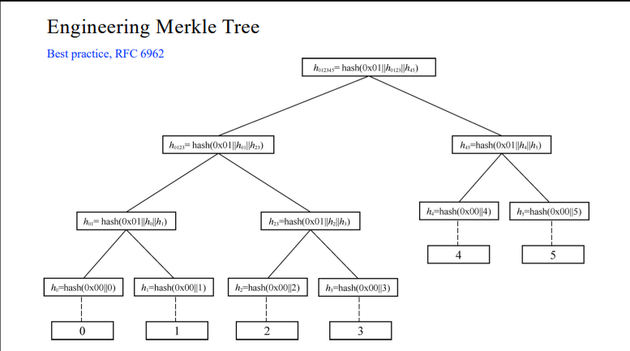
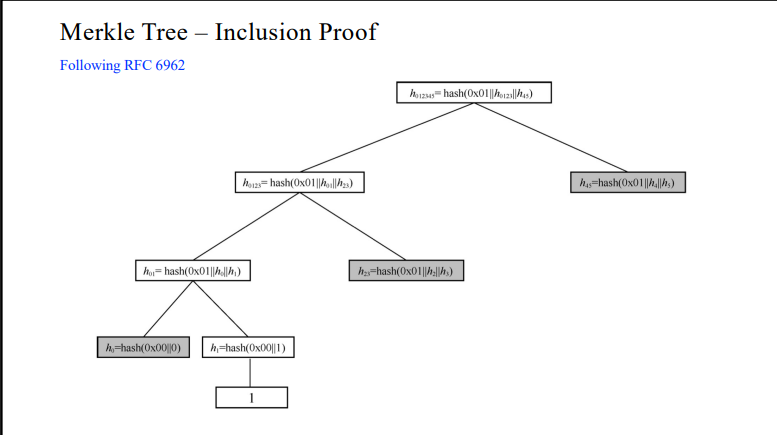
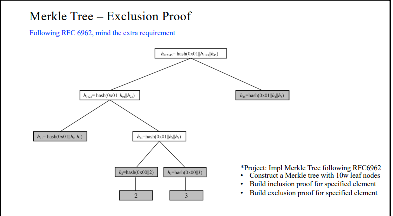
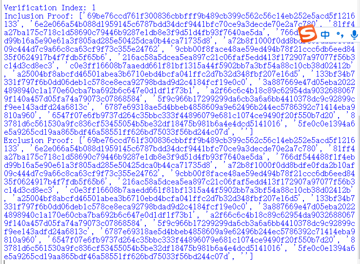

> ## 原理阐释
> Merkle树（Merkle Tree）是一种用于验证大量数据完整性的数据结构。它由计算机科学家Ralph Merkle在1979年提出。Merkle树的主要目的是快速检查大型数据集中的数据是否被篡改。Merkle树通过将数据分成固定大小的块，并使用哈希函数对每个块进行哈希运算来构建。然后，这些哈希值再次进行哈希运算，直到最终生成一个根哈希值，也称为根哈希。根哈希值可以用作数据集的唯一标识。当需要验证数据完整性时，可以通过比较根哈希值和已知的正确根哈希值来判断数据是否被篡改。如果数据被篡改，即使是对单个数据块的微小更改，根哈希值也会发生变化，从而使验证失败。Merkle树在许多领域中都有广泛应用，特别是在密码学和分布式系统中。它被用于比特币和其他加密货币的交易验证，以及分布式文件系统（如IPFS）中的数据完整性验证。 
> 以下是Merkle tree的构建方式：  
> 首先，将要构建Merkle树的数据分成固定大小的块。块的大小可以根据具体需求进行选择，通常是2的幂次方。  
> 对每个块进行哈希运算：对每个块使用哈希函数进行哈希运算，生成每个块的哈希值。常用的哈希函数包括SHA-256、MD5等。  
> 逐层构建树：将生成的哈希值两两配对，然后对每对进行哈希运算，生成新的哈希值。如果剩下奇数个哈希值，可以将最后一个哈希值复制一次以配对。这样，每个配对都生成一个新的哈希值。  
> 重复步骤3，直到只剩下一个根哈希值：将生成的哈希值再次两两配对，直到最终只剩下一个根哈希值。这个根哈希值就是Merkle树的根节点。  
> 
> Merkle Tree构建如图所示：
> 
>
>
> 包含证明的生成过程是从目标节点开始，沿着树向上遍历，收集每个节点的兄弟节点的哈希值。这样，我们可以通过验证这些哈希值和根哈希值的组合来验证目标节点是否存在于Merkle树中。
> inclusion proof 如图所示：
>
> 
>
> 排除证明的生成过程也是从目标节点开始，沿着树向上遍历，但此时我们收集的是目标节点本身的哈希值。这样，我们可以通过验证这些哈希值和根哈希值的组合来验证目标节点是否不在Merkle树中。
>
> 
>
> 
> ## 代码说明
> 
> 构建10w个节点
> 
>    ```python
>     # 示例数据块
      def generate_random_string(length):
          letters = string.ascii_letters
          return ''.join(random.choice(letters) for i in range(length))
          # 生成10w随机字符串，每个字符串长度为10
          data_blocks = [generate_random_string(10) for _ in range(100000)]
>
>
>构建merkle tree
> 
>    ```python
>     def build_merkle_tree(leaves):
    if len(leaves) == 1:
        return leaves[0]
    
    nodes = []
    for i in range(0, len(leaves), 2):
        left = leaves[i]
        right = leaves[i+1] if i+1 < len(leaves) else left
        combined_hash = calculate_hash(left + right)
        nodes.append(combined_hash)
    
    return build_merkle_tree(nodes)
>观察上述代码可知，我们通过生成随机字符来构建data_block。并按照上述原理阐释中构建merkle tree的方法来完成对其的构建。至于inclusion proof和exclusion proof代码放在Merkle tree.py，不在md文档进行展示。

>## 结果展示
>
>


