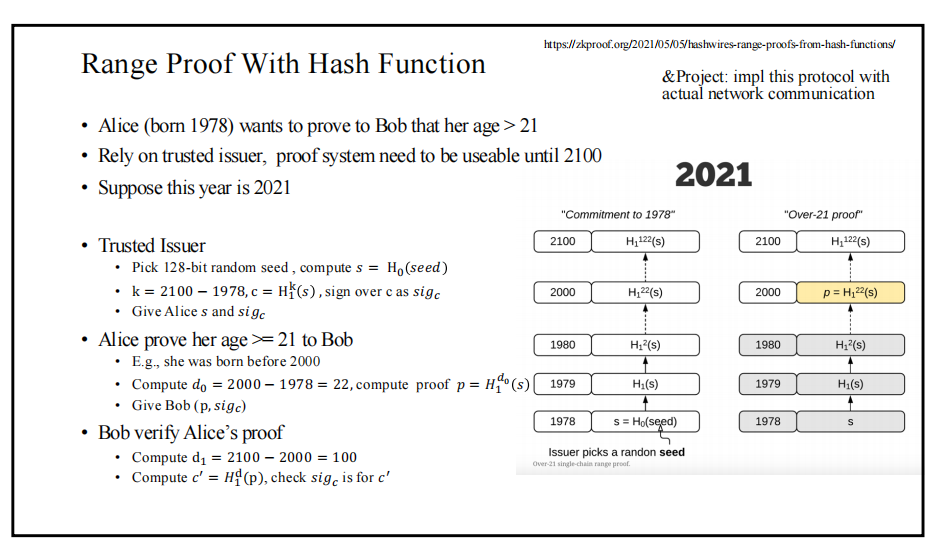

## 原理阐述
这个协议的步骤简单来说，是这样的。\
alice想去网吧，但她不想给别人看她的证件，此时就需要一个东西证明她到达18岁。此时，我们就可以使用这个协议。我们首先可以像权威机构请求申请一个种子信息，之后，我们收到种子seed信息后，把这个种子信息用hash加密自己的岁数遍，hash后的信息这里称之为hash_n。而当别人要求你证明你的年龄大于某一值a时，你只需要把seed用hash函数加密a遍，得到hash_a,并把hash_a和hash_n发给需要验证的人Bob。而当bob收到消息后，他就可以通过对hash_a再用hash函数加密(n-a)遍即可得到hash_n1，之后比较hash_n和hash_n1的关系，若相等，则证明alice的年龄足够。\
这个协议运用的原理就是hash的单向性，再一直种子和hash_n，想要延长或缩短hash链时困难的。


## 代码实现
这个项目要求再在网络上实现这个协议，在这里，我们就用cpp来实现网络交互。代码如下：
alice在代码里时验证方，这个代码简单来说就是先把要验证的数字发给bob，在从bob哪里接收验证的信息hash_a和hash_n，言震后把验证结果返回给bob即可。
```C++
//alice
int main() {
    WSADATA wsaData;
    if (WSAStartup(MAKEWORD(2, 2), &wsaData) != 0) {
        std::cerr << "Failed to initialize winsock." << std::endl;
        return 1;
    }

    std::string serverIP = "127.0.0.1";
    int serverPort = 12345;

    SOCKET sockfd = INVALID_SOCKET;
    while (sockfd == INVALID_SOCKET) {
        sockfd = socket(AF_INET, SOCK_STREAM, 0);
        if (sockfd == INVALID_SOCKET) {
            std::cerr << "Socket creation failed. Retrying..." << std::endl;
        }
    }

    sockaddr_in servaddr;
    servaddr.sin_family = AF_INET;
    servaddr.sin_port = htons(serverPort);
    inet_pton(AF_INET, serverIP.c_str(), &(servaddr.sin_addr));

    while (true) {
        if (connect(sockfd, (struct sockaddr*)&servaddr, sizeof(servaddr)) != SOCKET_ERROR) {
            break;
        }

        std::cerr << "Connection failed. Retrying..." << std::endl;
    }

    std::cout << "Connected to B." << std::endl;

    // 发送要求验证的数字
    int nihao;
    std::cout << "Please enter a number.\n";
    std::cin >> nihao;
    std::string number = std::to_string(nihao);
    int sentBytes = send(sockfd, number.c_str(), number.size(), 0);
    if (sentBytes == SOCKET_ERROR) {
        std::cerr << "Sending failed." << std::endl;
        closesocket(sockfd);
        WSACleanup();
        return 1;
    }

    // 从B处接收两个数字，一个是hash的中间结果，一个是最终结果
    char buffer[BUFFER_SIZE];
    int receivedBytes1 = recv(sockfd, buffer, BUFFER_SIZE, 0);
    if (receivedBytes1 == SOCKET_ERROR) {
        std::cerr << "Receiving failed." << std::endl;
        closesocket(sockfd);
        WSACleanup();
        return 1;
    }
    buffer[receivedBytes1] = '\0';
    std::string hexNumber1(buffer);

    int receivedBytes2 = recv(sockfd, buffer, BUFFER_SIZE, 0);
    if (receivedBytes2 == SOCKET_ERROR) {
        std::cerr << "Receiving failed." << std::endl;
        closesocket(sockfd);
        WSACleanup();
        return 1;
    }
    buffer[receivedBytes2] = '\0';
    std::string hexNumber2(buffer);

    std::cout << "Received numbers from B: " << hexNumber1 << ", " << hexNumber2 << std::endl;
    std::string message = "";
    if (sm3_n_times(hexNumber1, nihao) == hexNumber2)  message = "Pass!";
    else message = "Fail!";

    // 发送验证结果消息给B
    int sentBytes2 = send(sockfd, message.c_str(), message.size(), 0);
    if (sentBytes2 == SOCKET_ERROR) {
        std::cerr << "Sending failed." << std::endl;
        closesocket(sockfd);
        WSACleanup();
        return 1;
    }

    std::cout << "Sent message to B." << std::endl;

    closesocket(sockfd);
    WSACleanup();

    return 0;
}

> 
