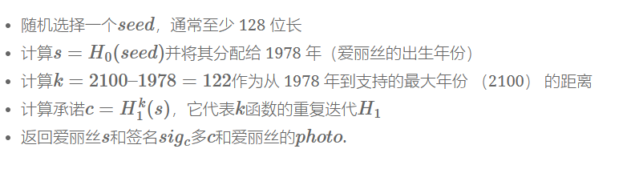
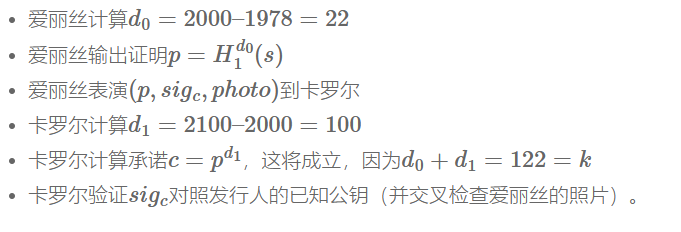
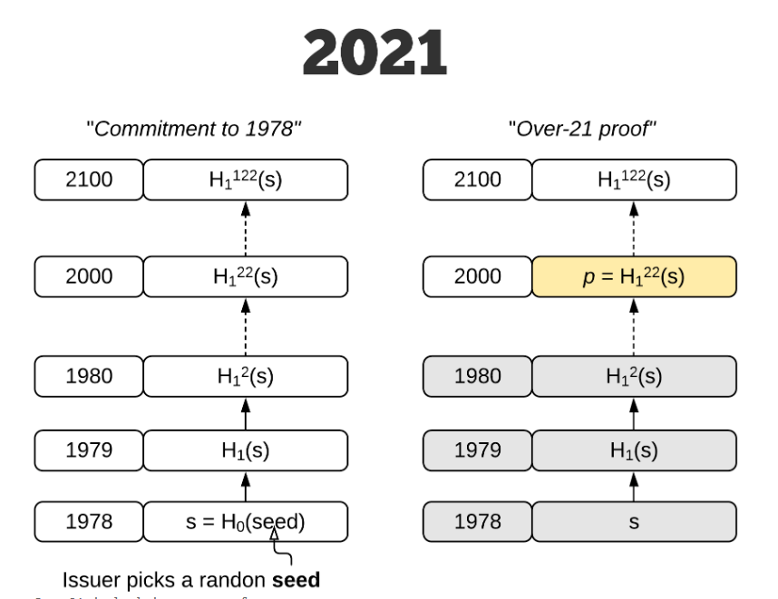

# 原理阐释
HashWires的灵感来自PayWord协议，PayWord协议是由Rivest和Shamir在1996年提出的一种基于哈希链的小额支付协议。最初的想法非常简单，完全基于哈希链计算。
## 朴素的解释
简而言之，对于我们的年龄示例，天真的 PayWord 方法的工作原理如下：现在是 2021 年，爱丽丝想在不出示身份证或驾驶执照的情况下向卡罗尔证明她至少年满 21 岁。正如每个密码学家可能知道的那样，Alice出生于1978年，当时RSA论文作者首次提到“对于我们的场景，我们假设A和B（也称为Alice和Bob）是公钥密码系统的两个用户”。但是让我们暂时假设卡罗尔不是密码学家，真的需要爱丽丝 21 岁以上的证明;此外，他们都信任政府颁发的证书。此外，假设我们想在 2100 年之前使用这个证明系统。 因此，Alice 的地方政府（发行人）将使用两个抗冲突哈希函数提供签名的加密承诺H0、H1（单个加盐哈希或 HMAC 函数，每个具有不同的盐/键H0和H1也可以工作）如图所示：  

因此，Alice得到了一个签名的哈希链承诺和一个秘密s。由于我们处于 2021 年，为了证明她（至少）出生于 21 年前，因此在 2000 年或之前，执行以下协议：  

以上之所以有效，是因为 Carol 确信 Alice 有一些已发布的秘密，至少有 100 个哈希链节点长，这反过来意味着 Alice 出生于 2000 年或之前（否则发行人永远不会向 Alice 提供这么长的链）。此外，证明p实际上是单个哈希值，只有 32 个字节，如下所示。

# 代码说明
我们通过构建CS模式来实现真实网络通信中的协议，代码细节实现如下：

服务器A
       
        >seed=""
        >for i in  range(16):
        >    seed+=ascii_letter[random.randint(0,len(ascii_letter)-1)]
        >print("生成的种子：", seed)
        >s=hashlib.sha256(seed.encode()).hexdigest()
        >k=useable_year-born_year
        >sig=s
        >for i in range(k):
        >    sig=hashlib.sha256(sig.encode()).hexdigest()
        >d0=now_year-prove_age-born_year
        >p=s
        >for i in range(d0):
        >    p= hashlib.sha256(p.encode()).hexdigest()
        >conn.send(serialize_dict({"p":p,"sig":sig})) 
客户端B
    
      >data=S.recv(1024)
      >message=deserialize_dict(data)
      >p=message['p']
      >sig=message['sig']
      >print("sig:",sig)
      >d1=useable_year-(now_year-prove_age)
      >c_=p
      >for i in range(d1):
      >   c_=hashlib.sha256(c_.encode()).hexdigest()
      >print("c':",c_)
      >if(c_==sig):
      >    print("Alice'age is older than ",prove_age)
      >else:
      >    print("Alice wants to cheat me!")
      >break
     
      
#  结果展示：

服务器端（用户A）

客户端（用户B）

