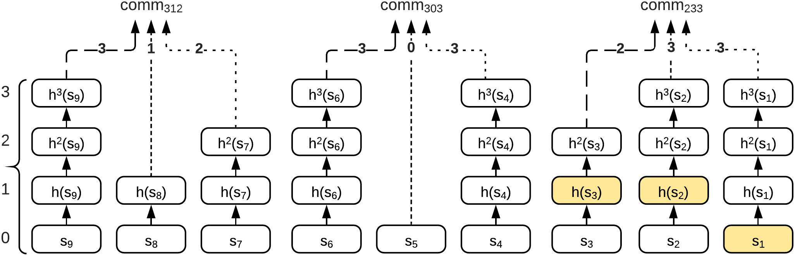
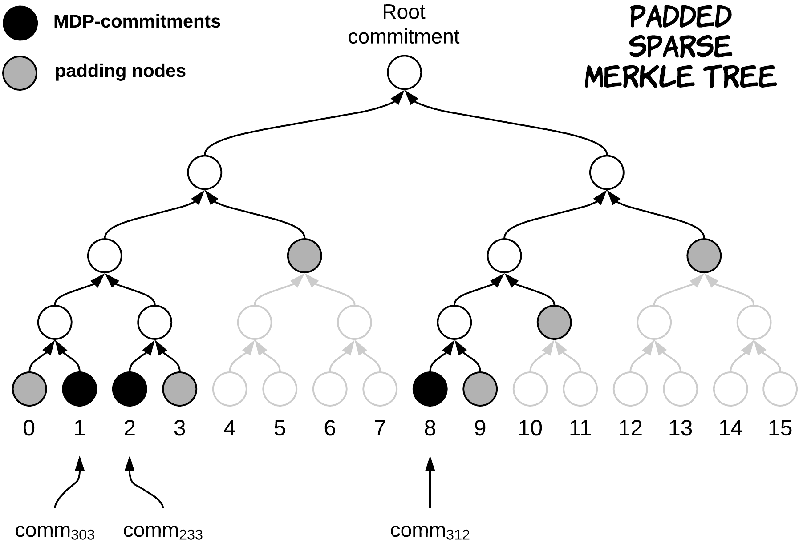

> # 原理阐述
> ## Generalizing Hashchains
> 在这一步中我们将project6中的方案以某种方式拆分单个链。即原来对某一个数字（记作承诺数）的验证只有一个链，现在转化为该数字的每一位都有一个hash链。
>
> 
>
> 但如果只是简单的按照位划分成几个hash链，对于哪些低位比该数字大的、但高位小的数，我们将无法验证。因为我们的低位的hash链只到我们有个承诺数在该位的值，而没有到该进制中每一位的上限。\
> 如在下图中，我们无法只用上述办法证明13997大于1599，因为13997个位上的7小于1599个位上的9.
>
> 
>
> ## Minimum Dominating Partitions
> 针对上面的情况，我们需要对承诺数生成多个hash多链。即对一个承诺数，我们生成一个列表，列表内容为它本身以及比其小的中最大的且后面i位均为该进制中每一位最大数的递减数列（i取遍1到承诺数的位数，若有重复，只算其中一个）。之后，我们只需要对列表中的每一个数都生成一个hash多链即可。当证明承诺时，我们只需要根据输入的数，从列表中选取比证明数大中最小的数的hash多链作为验证承诺的hash多链即可。\
> 举例如下:
>
> 
>
> ## Reusing Chains
> 完成了上述步骤后，为了减少一个承诺中需要存储的初始种子数和计算复杂度，我们可以只对承诺数的每一位都做一个大小为该进制中单位最大数的hash链。当对生成MDP列表中的元素生成其hash多链时，我们只需要截取、组合刚才生成的hash链即可得到一个承诺完整的多个hash多链。\
>如在下图中，我们对312这个承诺，我们只需要对第1、2、3位都做一个hash单链，然后MDP列表中的元素312、303、233要生成多链时，只需按需截取、组合前面的单链即可得到各自的hash多链，从而得到一个完整的承诺。
> 
> 
>
> ## Hiding the MDP Population
> 对于上面的方案，我们还会面临的问题是，MDP 列表的大小以及所选 MDP 承诺的索引可能会泄露有关已发布编号的信息。比如，发布了数字 02999（在最大可能的 99999 中）。然而，这个数字只需要MDP列表中的一个元素，即[2999]，因为它可以用来证明任何数字。但是，如果 Alice 透露了此信息（仅存在一个 MDP 承诺），则验证者会了解到发出的数字不能是 2998 或任何其他需要多个 MDP 值的整数。\
> 为了解决这个问题，我们准备采用填充稀疏默克尔树来存储MDP列表中每一个元素的hash多链中hash后的值。而当证明承诺时，我们到时只需证明发送来的那个hash多链在默克尔树上，这样就减少了信息的透露。
>
> 
>
> ## The Final HashWires Protocol
>
> 
>
> # 代码实现中的细节
> ## 1、填充稀疏默克尔树的填充规则
> 为了让每一个输入的叶信息可以尽可能多的影响根节点，我设计了一种特殊的填充方式。\
> 首先，在默克尔树的类中设计一个计数器，记录当前输入叶节点的数量num。之后，当有新的叶节点要加入时，我们只需要把num的二进制数从从左往右变为从右往左（比如说原来是0011，就变为1100），把新的叶节点加入到变化后的num指向的叶节点即可。
> ```C++
> unsigned int Jishu(int number, int length) {
    if (number <= 0) return number;
    int hello = 0;
    for (int middle = length / 2; middle > 0; middle = middle / 2) {
        if ((number & 1) == 1) {
            hello += middle;
        }
        number = number >> 1;
    }
    return hello;
    }

> ## 2、merkle树中获得证明叶节点所需的节点列表
> 这个函数就是返回该叶节点的每一个祖节点的兄弟节点的值即可
> ``` C++
> std::vector<std::string> getproof(std::string value) {
        std::vector<std::string> stringsArray;
        int numberhello = 0;
        for (int i = 0; i < Paddednumber; i++) {
            numberhello = Jishu(i, Nodenumber) + Nodenumber - 1;
            if (nodes[numberhello].data == value) break;
        }
        for (int i = 0; i < depth - 1; i++) {
            if ((numberhello & 1) == 1) {
                stringsArray.push_back(nodes[numberhello + 1].data);
            }
            else {
                stringsArray.push_back(nodes[numberhello - 1].data);
            }
            numberhello = (numberhello - 1) / 2;
        }
        stringsArray.push_back(nodes[0].data);
        return stringsArray;
    }

> ## 3、MDP算法的实现
> 我这里实现的MDP默认输入数字使用的进制为十进制，若采用其他进制，改遍该程序中一些数的值即可。\
> MDP算法就我理解来说，就是按顺序给承诺数的每一位减去一个数，使得新得到的数的结尾为i个9，i为减去的承诺数的位数。\
> 距离来说，256，就先对各位6减7得到249，在对十位减5得到199，即可得到最终答案。代码实现如下：
> ```C++
> std::vector<int> MDP(int number, int& weishu) {
    int a = number;
    int wei = 0;
    while (a > 0) {
        a = a / 10;
        wei += 1;
    }
    weishu = wei;
    std::vector<int> fanhui;
    fanhui.push_back(number);
    a = 10;
    int b = number;
    for (int i = 0; i < wei - 1; i++) {
        int c = (b % a) / (a / 10);
        if (c == 9)  continue;
        else {
            b = b - (c + 1) * a / 10;
            fanhui.push_back(b);
        }
        a = a * 10;
    }
    return fanhui;
}

>## 4、承诺的实现
>实现承诺我只需要先按输入的承诺数的位数n，生成n+1个种子，再将这n+1个种子中的后n个生成hash链，第一个种子hash后作为填充树的填充值来初始化树。之后，再更具MDP列表中的树，把相应的hash值加入到填充树中即可。代码如下：
>```C++
>class promise {
private:
    int Havenumber;
    SMT tree;
    std::vector<int> MDPlist;
    std::vector<std::string> seedlist;
    std::vector<std::string> prooflist;
public:
    promise(int number) {
        int weishu = 0;
        MDPlist = MDP(number, weishu);
        seedlist = init_string(weishu + 1);
        int MDPnumber = MDPlist.size();
        int i = 0;
        int y = 1;
        while (y < MDPnumber) {
            y *= 2;
            i++;
        }
        tree.init(i, sm3(seedlist[0]));
        std::string middle1;
        for (int j = 0; j < MDPnumber; j++) {
            int temp = MDPlist[j];
            int beishu = 10;
            std::string middle = "";
            for (int x = 1; x < weishu + 1; x++) {
                int c = (temp % beishu) / (beishu / 10);
                middle += sm3_n_times(seedlist[x], c);
                // std::cout << "sm3ntimes" << " Data: " << sm3_n_times(seedlist[x], c) << '\t' << c << '\t' << j << std::endl;
                beishu = beishu * 10;
            }
            //std::cout <<"MIDDLE: " << middle << '\n';
            tree.add(sm3(middle));
            prooflist.push_back(middle);
        }
    };

    //打印数据
    void printshuju() {
        std::cout << "Havenumber is " << Havenumber << '\n';
        for (int i = 0; i < MDPlist.size(); i++) {
            std::cout << "MDP " << i << " Data: " << MDPlist[i] << std::endl;
        }
        for (int i = 0; i < seedlist.size(); i++) {
            std::cout << "seed " << i << " Data: " << seedlist[i] << std::endl;
        }
        tree.printnodes();
    }

    //在一个promise中获得证明一个数字所需的数据
    bool getproof(std::vector<std::string>& seed, std::vector<std::string>& value, int verify, int& number) {
        int j = 0;
        if (verify > MDPlist[0])return 0;
        if (MDPlist[MDPlist.size() - 1] > verify) {
            j = MDPlist.size();
        }
        else {
            while (MDPlist[j] > verify) {
                j++;
            }
        }
        number = MDPlist[j - 1];
        for (int i = 0; i < seedlist.size() - 1; i++) {
            seed.push_back(seedlist[i + 1]);
        }
        /* for (int i = 0; i < seedlist.size() - 1; i++) {
            std::cout<< prooflist[j-1].substr(i*64,64)<<'\n';
         }*/
        value = tree.getproof(sm3(prooflist[j - 1]));
        return 1;
    }
};
> ## 4、验证承诺
> 验证承诺只需要先按照原来的方式，把得到的种子列表按照发来的数字进行hash得到一个最后的字符串，再根据发来的merkle树节点证明列表，证明最后输出的字符串在该树上即可。\
> 证明某一结点在merkle树上只需安顺序对发来的从下到上执行hash（hash（a）+b），最后判断得到的hash值叶与根节点的hash是否相等即可。\
> 代码实现：
> ```C++
> bool verify(std::vector < std::string> seed, std::vector < std::string> valuelist, int& number) {
    std::string middle = "";
    int x = 10;
    for (int i = 0; i < seed.size(); i++) {
        int c = (number % x) / (x / 10);
        middle += sm3_n_times(seed[i], c);
        //std::cout << "ntimes" << " Data: " << sm3_n_times(seed[i], c) << '\t' << c << std::endl;
        x = x * 10;
    }
    //std::cout << "proof"  << " Data: " << middle <<'\t'<<number<< std::endl;
    return  proof(valuelist, sm3(middle));
   }
> ```C++:
> bool proof(std::vector<std::string> proofarray, std::string value) {
    int sizeproof = proofarray.size();
    std::string middle = value;
    for (int i = 0; i < sizeproof - 1; i++) {
        middle = sm3(addHexBigIntegers(middle, proofarray[i]));
    }
    if (middle == proofarray[sizeproof - 1]) return true;
    else return false;
}
> 

# 结果展示

>  
>  

# 文件时间
>  

  >

