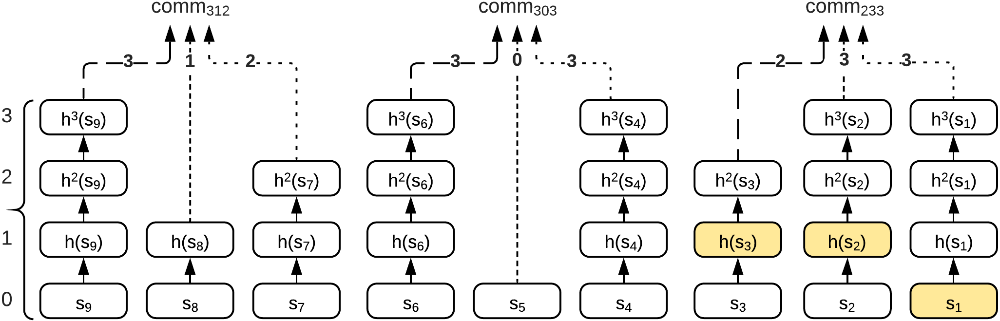
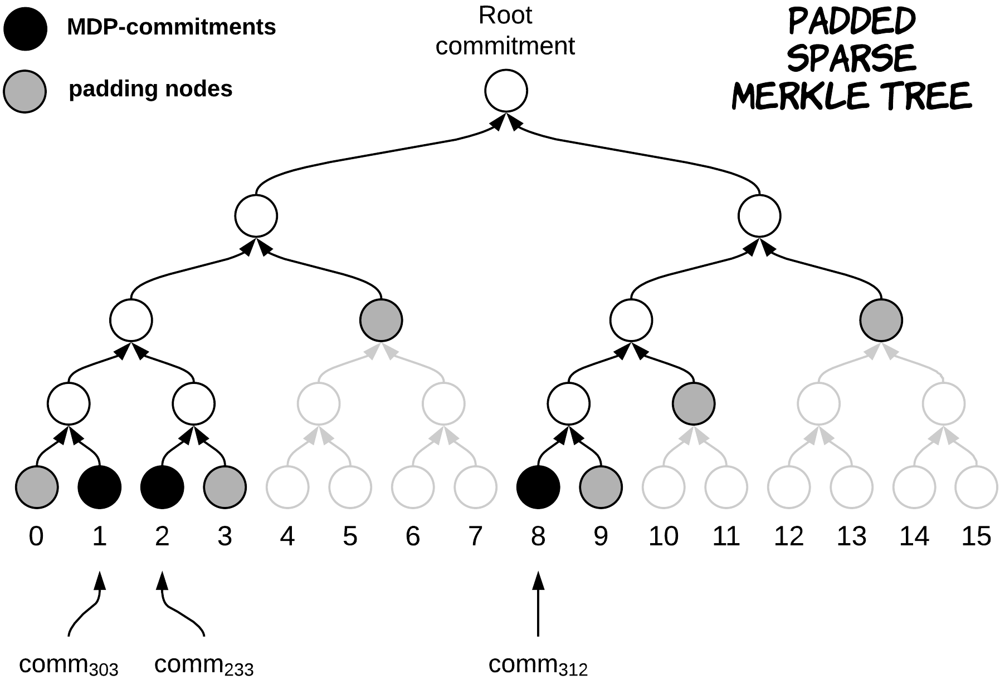
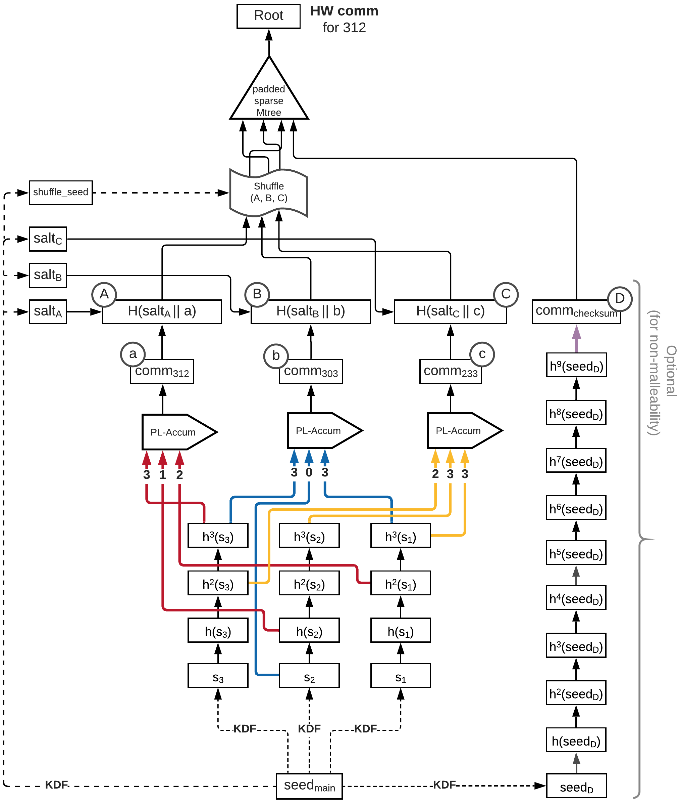

> # 原理阐述
> ## Generalizing Hashchains
> 在这一步中我们将project6中的方案以某种方式拆分单个链。即原来对某一个数字（记作承诺数）的验证只有一个链，现在转化为该数字的每一位都有一个hash链。
>
> 
>
> 但如果只是简单的按照位划分成几个hash链，对于哪些低位比该数字大的、但高位小的数，我们将无法验证。因为我们的低位的hash链只到我们有个承诺数在该位的值，而没有到该进制中每一位的上限。\
> 如在下图中，我们无法只用上述办法证明13997大于1599，因为13997个位上的7小于1599个位上的9.
>
> 
>
> ## Minimum Dominating Partitions
> 针对上面的情况，我们需要对承诺数生成多个hash多链。即对一个承诺数，我们生成一个列表，列表内容为它本身以及比其小的中最大的且后面i位均为该进制中每一位最大数的递减数列（i取遍1到承诺数的位数，若有重复，只算其中一个）。之后，我们只需要对列表中的每一个数都生成一个hash多链即可。当证明承诺时，我们只需要根据输入的数，从列表中选取比证明数大中最小的数的hash多链作为验证承诺的hash多链即可。\
> 举例如下:
>
> 
>
> ## Reusing Chains
> 完成了上述步骤后，为了减少一个承诺中需要存储的初始种子数和计算复杂度，我们可以只对承诺数的每一位都做一个大小为该进制中单位最大数的hash链。当对生成MDP列表中的元素生成其hash多链时，我们只需要截取、组合刚才生成的hash链即可得到一个承诺完整的多个hash多链。\
>如在下图中，我们对312这个承诺，我们只需要对第1、2、3位都做一个hash单链，然后MDP列表中的元素312、303、233要生成多链时，只需按需截取、组合前面的单链即可得到各自的hash多链，从而得到一个完整的承诺。
> 
> 
>
> ## Hiding the MDP Population
> 对于上面的方案，我们还会面临的问题是，MDP 列表的大小以及所选 MDP 承诺的索引可能会泄露有关已发布编号的信息。比如，发布了数字 02999（在最大可能的 99999 中）。然而，这个数字只需要MDP列表中的一个元素，即[2999]，因为它可以用来证明任何数字。但是，如果 Alice 透露了此信息（仅存在一个 MDP 承诺），则验证者会了解到发出的数字不能是 2998 或任何其他需要多个 MDP 值的整数。\
> 为了解决这个问题，我们准备采用填充稀疏默克尔树来存储MDP列表中每一个元素的hash多链中hash后的值。而当证明承诺时，我们到时只需证明发送来的那个hash多链在默克尔树上，这样就减少了信息的透露。\
>
> 
>
> ## The Final HashWires Protocol
>
> 
