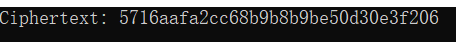
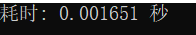

>## 说明
>由于我的电脑是Intel架构，所以我直接实现的AES-NI，特此说明！
> ## 原理阐释
> AES (Advanced Encryption Standard) is an encryption standard adopted by the U.S. government starting in 2001. It is widely used across the software ecosystem to protect network traffic, personal data, and corporate IT infrastructure. AES is a symmetric block cipher that encrypts/decrypts data through several rounds. The new 2010 Intel® Core™ processor family (code name Westmere) includes a set of new instructions, Intel® Advanced Encryption Standard (AES) New Instructions (AES-NI). The instructions were designed to implement some of the complex and performance intensive steps of the AES algorithm using hardware and thus accelerating the execution of the AES algorithms. AES-NI can be used to accelerate the performance of an implementation of AES by 3 to 10x over a completely software implementation.
> ## 代码说明
> 我们已经使用AES-NI指令实现了AES，下面展示关键代码。
> 
>  __基于前面已经实现的SM3优化，我认为该指令本质上就是对于AES采用单指令多数据的并行化处理。__
>
>    ```c++
>    #define DO_ENC_BLOCK(m,k) \
	do{\
        m = _mm_xor_si128       (m, k[ 0]); \
        m = _mm_aesenc_si128    (m, k[ 1]); \
        m = _mm_aesenc_si128    (m, k[ 2]); \
        m = _mm_aesenc_si128    (m, k[ 3]); \
        m = _mm_aesenc_si128    (m, k[ 4]); \
        m = _mm_aesenc_si128    (m, k[ 5]); \
        m = _mm_aesenc_si128    (m, k[ 6]); \
        m = _mm_aesenc_si128    (m, k[ 7]); \
        m = _mm_aesenc_si128    (m, k[ 8]); \
        m = _mm_aesenc_si128    (m, k[ 9]); \
        m = _mm_aesenclast_si128(m, k[10]);\
    }while(0)


>   ```c++
>    #define DO_DEC_BLOCK(m,k) \
	do{\
        m = _mm_xor_si128       (m, k[10+0]); \
        m = _mm_aesdec_si128    (m, k[10+1]); \
        m = _mm_aesdec_si128    (m, k[10+2]); \
        m = _mm_aesdec_si128    (m, k[10+3]); \
        m = _mm_aesdec_si128    (m, k[10+4]); \
        m = _mm_aesdec_si128    (m, k[10+5]); \
        m = _mm_aesdec_si128    (m, k[10+6]); \
        m = _mm_aesdec_si128    (m, k[10+7]); \
        m = _mm_aesdec_si128    (m, k[10+8]); \
        m = _mm_aesdec_si128    (m, k[10+9]); \
        m = _mm_aesdeclast_si128(m, k[0]);\
    }while(0)


>## 结果展示
>### 结果的正确性
>OPENSSL
>
>
>
>
>ARM指令
>
>
>
>
>
>### 速度展示
>我们对128bit数据执行一次AES运算
>ARM实现
>
>
>
>
>
>OPENSSL实现
>
>
>
>
>


