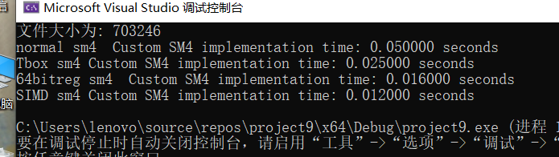

## 原理阐述
SM4，也称为国家商用密码算法，是中国政府推出的一种对称加密算法。它是一种分组密码算法，意味着它将输入分成固定长度的数据块，并对每个数据块进行加密或解密。SM4算法采用分组长度为128位，密钥长度为128位的设计，其设计目标是提供高安全性和高性能。\
SM4的加密过程可以概括为以下几个步骤：\
密钥扩展：首先对输入的128位密钥进行扩展，生成32个子密钥，用于后续的轮加密操作。\
轮加密：将输入的明文分成128位数据块，然后进行一系列的轮加密操作。每一轮都包括三个步骤：s盒，T变换和异或。\
输出密文：对所有经过轮加密的数据块进行合并，得到最终的密文输出。\
sm4的原理图如下：
 

 ## 实现思路
### 基础实现
在这一步中，我们没有加入自己的一些加速内容，只是简单的按照sm4的流程复现了一遍。由于代码篇幅问题，在这里不予直接展示。
### Tbox实现
在sm4中我们可以通过将sbox和T变换合并，将原来的F=T（s（x0），s（x1），s（x2），s（x3）），变成F = tbox0（x0）^tbox1（x1）^tbox2（x2）^tbox3（x3），tbox相比原来的s盒由一个8bit输入8bit输出的表，变为了4个8bit输入32bit输出的表，增大了查找表的存储。但是，这个操作可以让轮函数减少操作，每次轮函数只用查询一次表后进行一次异或即可实现。代码实现如下：
```C++
uint32_t T1(uint32_t x) {
    uint8_t a0 = x >> 24;
    uint8_t a1 = x >> 16;
    uint8_t a2 = x >> 8;
    uint8_t a3 = x;

    uint32_t a00 = TboxTable0[a0];
    uint32_t a11 = TboxTable1[a1];
    uint32_t a22 = TboxTable2[a2];
    uint32_t a33 = TboxTable3[a3];

    return a00 ^ a11 ^ a22 ^ a33;
}
uint32_t F11(uint32_t x0, uint32_t x1, uint32_t x2, uint32_t x3, uint32_t rk) {
    return x0 ^ T1(x1 ^ x2 ^ x3 ^ rk);
}
void sm4_encrypt1(const uint32_t* plaintext, const uint32_t* round_keys, uint32_t* ciphertext) {
    uint32_t x[4];
    for (int i = 0; i < 4; ++i) {
        x[i] = plaintext[i];
    }

    for (int i = 0; i < 32; ++i) {
        uint32_t t = F11(x[0], x[1], x[2], x[3], round_keys[i]);
        x[0] = x[1];
        x[1] = x[2];
        x[2] = x[3];
        x[3] = t;
    }

    for (int i = 0; i < 4; ++i) {
        ciphertext[3 - i] = x[i];
    }
}
void sm4_decrypt1(const uint32_t* ciphertext, const uint32_t* round_keys, uint32_t* plaintext) {
    uint32_t x[4];
    for (int i = 0; i < 4; ++i) {
        x[i] = ciphertext[i];//<<32 | ciphertext[i+4];
    }

    for (int i = 0; i < 32; ++i) {
        //uint64_t rk = static_cast<uint64_t>(round_keys[31 - i]) << 32 | round_keys[31 - i];
        uint32_t t = F11(x[0], x[1], x[2], x[3], round_keys[31 - i]);
        x[0] = x[1];
        x[1] = x[2];
        x[2] = x[3];
        x[3] = t;
    }

    for (int i = 0; i < 4; ++i) {
        plaintext[3 - i] = x[i];//>> 32;
    }
}
```
 ### 64bit寄存器的利用
现在电脑的寄存器基本都是用的64bit的，而在sm4加密时，操作的单位都是32bit的，浪费了寄存器的一些存储能力。所以，为了更好的利用电脑的寄存器，我们可以在加密过程中以两个块为基本单位，这样在加密过程中的操作数就是64bit的，更好的利用了寄存器的能力。\
在具体实现时，我们只需要对两个块中相应位置的数存到通一变量中即可，比如说第一个块的x0和第二个块的x0就存到同一个变量中，在轮函数加密过程中，再根据实际需要，把这俩分开，即可实现。代码实现如下：
 ```cpp
 uint64_t T12(uint64_t x) {
    uint8_t a0 = x >> 56;
    uint8_t a1 = x >> 48;
    uint8_t a2 = x >> 40;
    uint8_t a3 = x >> 32;
    uint8_t a4 = x >> 24;
    uint8_t a5 = x >> 16;
    uint8_t a6 = x >> 8;
    uint8_t a7 = x;
    uint64_t a00 = (static_cast<uint64_t>(TboxTable0[a0]) << 32) | TboxTable0[a4];
    uint64_t a11 = (static_cast<uint64_t>(TboxTable1[a1]) << 32) | TboxTable1[a5];
    uint64_t a22 = (static_cast<uint64_t>(TboxTable2[a2]) << 32) | TboxTable2[a6];
    uint64_t a33 = (static_cast<uint64_t>(TboxTable3[a3]) << 32) | TboxTable3[a7];
    //std::cout << std::hex <<"hellowold:" <<( a00 ^ a11 ^ a22 ^ a33) << '\n';
    return a00 ^ a11 ^ a22 ^ a33;
}
uint64_t F12(uint64_t x0, uint64_t x1, uint64_t x2, uint64_t x3, uint64_t rk) {
    //std::cout << std::hex << "hellowold:" << (x0 ^ T12(x1 ^ x2 ^ x3 ^ rk)) << '\n';
    return x0 ^ T12(x1 ^ x2 ^ x3 ^ rk);
}
void sm4_encrypt2(const uint32_t* plaintext, const uint32_t* round_keys, uint32_t* ciphertext) {
    uint64_t x[4];
    for (int i = 0; i < 4; ++i) {
        x[i] = static_cast<uint64_t>(plaintext[i]) << 32 | plaintext[i + 4];
        //std::cout << std::hex << x[i] <<'\t'<< plaintext[i] << '\n';
    }
    for (int i = 0; i < 32; ++i) {
        uint64_t rk = static_cast<uint64_t>(round_keys[i]) << 32 | round_keys[i];
        uint64_t t = F12(x[0], x[1], x[2], x[3], rk);
        //std::cout << std::hex << x[0] << '\n';
        x[0] = x[1];
        x[1] = x[2];
        x[2] = x[3];
        x[3] = t;
    }
    for (int i = 0; i < 4; ++i) {
        ciphertext[3 - i] = x[i] >> 32;
        ciphertext[7 - i] = x[i];
        std::cout << std::hex << x[i] << '\t' << ciphertext[3 - i] << '\t' << ciphertext[7 - i] << '\n';
    }
}
void sm4_decrypt2(const uint32_t* ciphertext, const uint32_t* round_keys, uint32_t* plaintext) {
    uint64_t x[4];
    for (int i = 0; i < 4, ++i) {
        x[i] = static_cast(ciphertext[i<uint64_t>]) << 32 | ciphertext[i + 4];
    }
    for (int i = 0; i < 32; ++i) {
        uint64_t rk = static_cast(round_keys[31 - i<uint64_t>]) << 32 | round_keys[31 - i];
        uint64_t t = F12(x[0], x[1], x[2], x[3], rk);
        x[0] = x[1];
        x[1] = x[2];
        x[2] = x[3];
        x[3] = t;
    }
    for (int i = 0; i < 4, ++i) {
        plaintext[3 - i] = x[i] >> 32;
        plaintext[7 - i] = x[i];
    }
}
```
### SIMD加速
SIMD是一种并行计算技术，允许同时对多个数据元素执行相同的操作，从而在单个指令下进行多次计算，提高了算法的并行性和运算效率。在本实验中，我们通过对SM4算法进行SIMD优化，充分利用现代计算平台的并行计算能力，以实现对SM4加密解密过程的加速。\
代码如下：
```cpp
__m256i T13(__m256i result) {
    uint8_t temp[32]; // 假设 __m256i 变量包含 32 个 8 位元素
    _mm256_storeu_si256((__m256i*)temp, result);
    int a1[8], a2[8], a3[8], a0[8];
    // 将提取的字节存储在目标数组中
    for (int j = 0; j < 8; j++) {
        a0[j] = temp[j * 4 + 0];
        a1[j] = temp[j * 4 + 1];
        a2[j] = temp[j * 4 + 2];
        a3[j] = temp[j * 4 + 3];
    }
    __m256i vindex = _mm256_setr_epi32(0, 1, 2, 3, 4, 5, 6, 7);
    __m256i a00, a11, a22, a33;
    a00 = _mm256_i32gather_epi32(a0, vindex,4);
    a11 = _mm256_i32gather_epi32(a1, vindex, 4);
    a22 = _mm256_i32gather_epi32(a2, vindex, 4);
    a33 = _mm256_i32gather_epi32(a3, vindex, 4);
    a00=_mm256_i32gather_epi32((int*)TboxTable0, a00, 4);
    a11 = _mm256_i32gather_epi32((int*)TboxTable1, a11, 4);
    a22 = _mm256_i32gather_epi32((int*)TboxTable2, a22, 4);
    a33 = _mm256_i32gather_epi32((int*)TboxTable3, a33, 4);

    __m256i temp1 = _mm256_xor_si256(a00, a11);
    __m256i temp2 = _mm256_xor_si256(a22, a33);

    return _mm256_xor_si256(temp1, temp2);
}
__m256i F13(__m256i a, __m256i b, __m256i c, __m256i d, __m256i key) {
    __m256i temp1 = _mm256_xor_si256(a, b);
    __m256i temp2 = _mm256_xor_si256(c, d);
    __m256i result = _mm256_xor_si256(temp1, temp2);
    result = T13(result);
    return _mm256_xor_si256(result, key);
}
void sm4_encrypt3(const uint32_t* plaintext, const uint32_t* round_keys, uint32_t* ciphertext, int i) {
    __m256i vindex, R0, R1, R2, R3,rk,Rmiddle;
    vindex = _mm256_setr_epi32(0, 4, 8, 12, 16, 20, 24, 28);
    R0 = _mm256_i32gather_epi32((int*)(plaintext + 4 * 0+i*32), vindex, 4);
    R1 = _mm256_i32gather_epi32((int*)(plaintext + 4 * 1+i*32), vindex, 4);
    R2 = _mm256_i32gather_epi32((int*)(plaintext + 4 * 2+i*32), vindex, 4);
    R3 = _mm256_i32gather_epi32((int*)(plaintext + 4 * 3+i*32), vindex, 4);
    for (int i = 0; i < 32; ++i) {
        __m256i index = _mm256_setzero_si256();
        rk = _mm256_i32gather_epi32((int*)(round_keys + i),index,4);
        __m256i t = F13(R0, R1, R2,R3, rk);
        R0 =R1;
        R1=R2;
        R2 = R3;
        R3 = t;
    }
    int temp[4][8]; // 假设 __m256i 变量包含 32 个 8 位元素
    _mm256_storeu_si256((__m256i*)temp[0], R3);
    _mm256_storeu_si256((__m256i*)temp[1], R2);
    _mm256_storeu_si256((__m256i*)temp[2], R1);
    _mm256_storeu_si256((__m256i*)temp[3], R0);
    for (int k = 0; k < 8; k++) {
        for (int j = 0; j < 4; j++) {
            ciphertext[i * 32 + k * 4 + j] = temp[j][k];
        }
    }
    
}
```

## 结果展示
在本次实验中，我们选择一个703246字节大小的文件做为加密对象，不同加密方案的运行时间如下。
 
 
通过上面的结果可以看出，在这个文件的加密过程中，我们的加密方案都比py平台的openssl库快。\
对于我自己实现的方案中，Tbox对于不加速前的算法大概快了两倍，64bit的寄存器又比Tbox快了大概1.56倍，最后的SIMD加速又比Tbox1.3倍。
表格如下：
>|          | 原版 | Tbox| 64位寄存器   | SIMD |Openssl|  
>|----------|--------|--------|--------|--------|--------|
>| SM4      |0.05s | 0.025s |0.016s | 0.012s|0.11s|
## 文件时间
 
