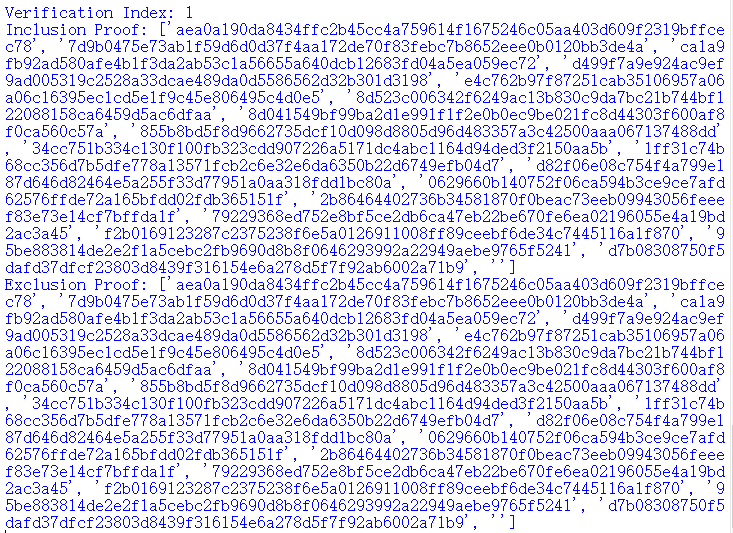
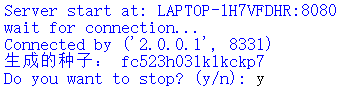
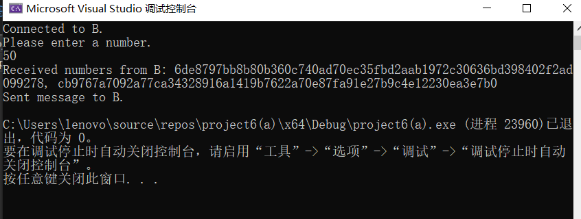
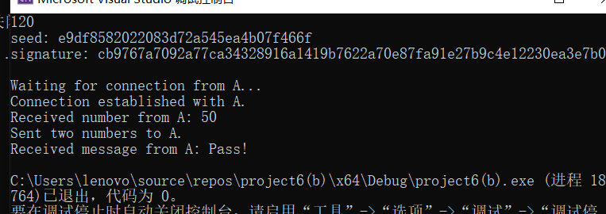
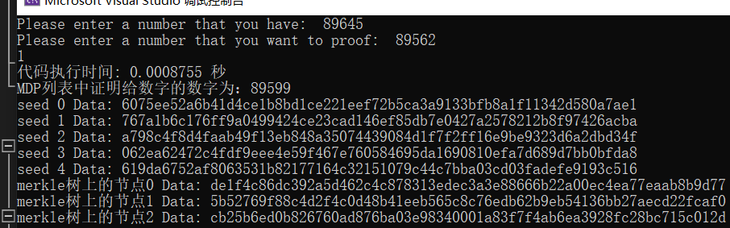
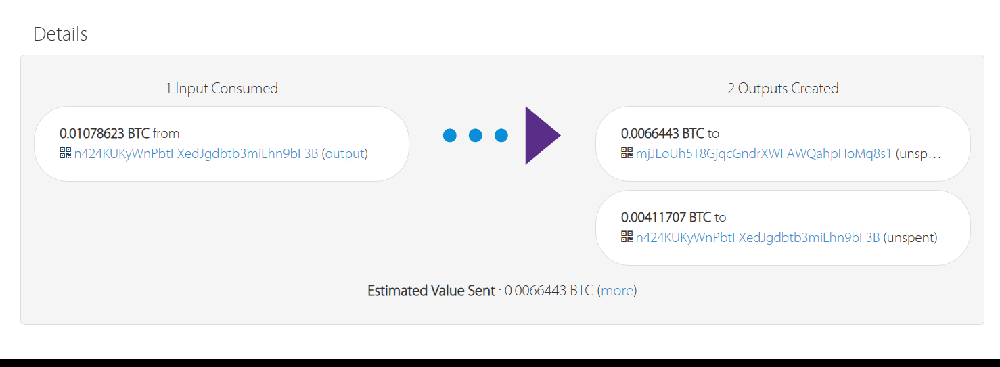
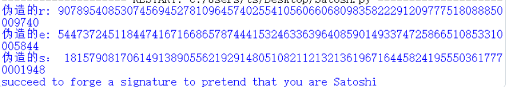
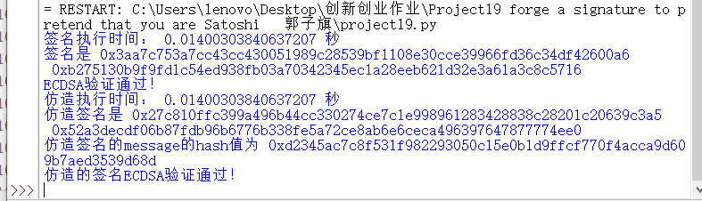
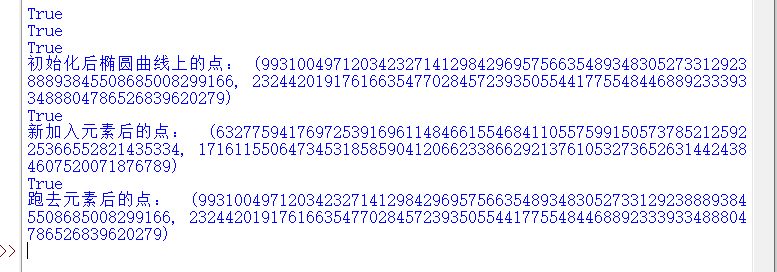

# 报告展示
**尊敬的老师与助教老师们，你们好!**   
**本次实验由唐诗和郭子旗两人完成。下面是分工表以及各个实验的实现概要。**
## 分工表
>|       | 1 | 2|3 | 4 | 5 |6 |7 |8 | 9| 10|11 | 12 | 13 |14 |15 |16 | 17 | 18|19 |20|21|22 |总计|
>|-------|---|--|--|---|---|--|--|--|--|---|---|----|----|---|---|---|----|---|---|--|--|---|----|
>| 唐诗   | 1| 1| 1| 1  |1 |1 |0 | 1| 1| 1 | 1 |1   |1  |1  | 1 | 1 | 1  | 0  |1  |1 | 1| 1 | 20 |
>| 郭子旗 | 1| 1| 1| 1  |1 |1 |1 | 1| 1| 1 | 1 |1   |1   |1  | 1 | 1 | 1  | 1 |1  |1 | 1| 1 |    |
两人完成全部实验内容，project完成数合计（）。  
两人承诺各自完成自己的试验，相同实验并没交换思路，老师可放心阅读！
## Project1: implement the naïve birthday attack of reduced SM3
### 主要贡献
完成了生日悖论的概率推导。  
实现了SM3和SHA256各自的生日碰撞攻击。  
### 实现思路
创建哈希表来记录message及其对应的hash值，来判断有无发生生日碰撞。  
采用生成固定长度的字符串的方式来完成测试。  
### 实现结果
>|        | 8bits  | 16bits | 24bits | 32bits | 40bits |44bits |48bits |52bits |
>|--------|--------|--------|--------|--------|--------|-------|-------|-------|
>| SM3    | 0.036s | 0.154s | 1.307s | 11.736s|782.692s|1850.594s|       |       |
>| SHA256 | 0.026s | 0.024s | 0.026s | 0.127s | 3.806s |3.877s |51.939s|1504.711s|
>
## Project2: implement the Rho method of reduced SM3
### 主要贡献
学习了Rho算法在整数分解中的应用。  
掌握了Rho算法的时间复杂度。  
### 实现思路
龟兔赛跑完成Rho算法。  
与random和birthday attack进行了效率以及复杂度比较。  
### 实现结果
>|        | 4bits  | 8bits | 12bits | 16bits | 18bits |24bits|
>|--------|--------|--------|--------|-------|--------|------|
>| SHA256 | 0.010s | 0.012s | 0.012s | 0.066s| 0.065s   |13.146|
>| SM3    | 0.009s | 0.535s | 4.510s | 176.596s | |
>
## Project3: implement length extension attack for SM3, SHA256, etc.
### 主要贡献
实现SM3国密算法。  
掌握了长度扩展攻击在密码实践中的应用（如MAC）。  
### 实现思路
利用md结构的缺陷，建立相应的等式，实现长度扩展攻击。  
### 实现结果

## Project4:do your best to optimize SM3 implementation (software)
### 主要贡献
学习并应用一些编译器无法实现的优化。  
### 实现思路
测试原SM3，发现哪一计算模块时间占比较大。  
尝试查表法、重写Rotate_left函数、循环展开、降低低效率循环、使用单指令多数据、使用流水线技术、memory alising等技术。  
### 实现结果 
>|          | SM3  | rapid_SM3|gmssl   | Openssl| 
>|----------|--------|--------|--------|--------|
>| SM3      |1.14e-05s | 1.14e-06s |0.0003s | 0.001s|
>| SM310000 | 0.095s | 0.006s | 2.641s |0.009s |
我们可以看到，优化后的SM3较之前有了十倍的性能提升，执行10000次运算效率优于OPENSSL。  
## Project5: Impl Merkle Tree following RFC6962
### 主要贡献
学习二叉树等数据结构。  
理解inclusion proof和exclusion proof的应用场景和区别。  
了解Merkle Tree在比特币等方面的应用。  
### 实现思路
采用生成随机字符串的方式完成10w叶子结点的构建。  
生成和验证来完成proof。  
### 实现结果

## Project6:impl this protocol with actual network communication
### 主要贡献
理解了range proofs from hash function的原理。  
阅读文章<https://zkproof.org/2021/05/05/hashwires-range-proofs-from-hash-functions/>,进一步了解Generalizing Hashchains、Minimum Dominating Partitions和The Final HashWires Protocol。
### 实现思路
构建客户端服务器模式实现网络通信。  
利用((hash)a)b=(hash)(a+b)的原理，完成range proofs.  
### 实现结果
 

## Project6:impl this protocol with actual network communication 郭子旗
### 主要贡献
理解这个协议的基本内容，用cpp实现网络通信。
### 实现思路
利用cpp构建客户端服务器模式实现网络通信。  
利用((hash)a)b=(hash)(a+b)的原理，完成range proofs.  
### 实现结果
 

## Project7:Try to Implement this scheme  郭子旗
### 主要贡献
自己写了一个简易的 padded sparse tree，并运用了自己的在书中添加新元素的算法。\
理解了hashwire的基本工作原理。
### 实现思路
用cpp实现padded sparse tree，并调用hashwire库里的内容，实现sm3作为hash函数。对于之后的实现，借鉴project6的内容即可。
### 实验结果

## Project8:AES impl with ARM instruction 
### 主要贡献
由于电脑是Intel型号，且另一队友实现了ARMi，故学习并应用了Intel instruction。  
进一步理解SIMD指令以及其优化效果。  
### 实现思路
利用AES-Ni模块完成AES运算。  
### 实现结果
>|        | 单次加密运行时间  | 
>|--------|--------|
>| AES-Ni | 4.21e-5s |
>| OPENSSL| 0.001651s | 
>
## Project9:AES / SM4 software implementation
### 主要贡献
学习并掌握AES算法。  
理解其S盒的构建方式，以及mixcolumn的参数选择及其背后的原因。  
### 实现思路
按照密钥异或、s盒替换、行混合和列混淆实现轮函数。  
实现相应的密钥拓展。  
### 实现结果

## Project9: SM4 software implementation 郭子旗
### 主要贡献
利用Tbox，64位寄存器的利用和SIMD指令加速了SM4算法。
### 实现思路
得到Tbox中的T盒子，减少加密操作步骤。 每次加密两个区块，充分利用64位寄存器的优势。最后，我使用了SIMD指令集，同时对多个快操作，进一步实现加速。
### 实现结果
加密文件大小为703246字节。
>|          | 原版 | Tbox| 64位寄存器   | SIMD |Openssl|  
>|----------|--------|--------|--------|--------|--------|
>| SM4      |0.05s | 0.031s |0.017s | 0.012s|0.11s|
## Project10: report on the application of this deduce technique in Ethereum with ECDSA
### 主要贡献
首先，掌握ECDSA算法。  
然后，掌握通过签名推导公钥的方法。  
最后，通过学习具体的以太坊交易，来完成恢复公钥的实际应用。  
## Project11: impl sm2 with RFC6979
### 主要贡献
阅读SM2文档，掌握其常见的数据类型转换。  
理解加解密与签名验证算法实现思路。  
### 实现思路
没有调用已经实现好的SM2模块，而是在引入椭圆曲线库的基础上自行实现国密算法SM2。  
接口设计合理，可以实现固定和随机两种参数生成方式。  
### 实现结果

## Project12: verify the above pitfalls with proof-of-concept code
### 主要贡献
理解签名算法常见的pitfalls。  
理解上述pitfalls的数学证明思路。  
### 实现思路
构建上述pitfall的场景，设计proof-of-concept code。  
### 实现结果

## Project13: Implement the above ECMH scheme
该协议在project20处实现。  
## Project14: Implement a PGP scheme with SM2
### 主要贡献
阅读SM2的密钥交换文档，掌握其协议流程。  
了解PGP的工作模式和实现方式。  
### 实现思路
由于ppt上会话密钥是随机生成，故我们的PGP协议采用了这种方式，没有使用SM2密钥交换协议。  
但是，我们仍然完成了SM2密钥交换协议的实现。  
### 实现结果

## Project15: implement sm2 2P sign with real network communication
### 主要贡献
理解两方签名的原理和优势。  
比较与单方签名效率的比较。  
### 实现思路
调用python的socket模块完成网络通信。  
按照2P协议流程完成SM2签名。  
### 实现结果
|        |随机数k | mul_point | 生成公钥 |运行时间|
|--------|--------|-----------|----------|---------|
| SM2单方|   1     | 1        | 无      | 0.003s  |
| SM2两方 | 3       | 3        | 有      | 0.013s  |

由此可以看出，SM2单方签名比2P模式快四倍左右。  
## Project16: implement sm2 2P decrypt with real network communication
### 主要贡献
理解两方解密的原理和优势。  
比较与单方解密效率的比较。  
### 实现思路
调用python的socket模块完成网络通信。  
按照2P协议流程完成SM2解密。  
### 实现结果
|        |随机数k | mul_point | 加密 | KDF|运行时间|
|--------|--------|-----------|----------|----|-----|
| SM2单方|   0     | 1        | 无      | 1    |0.0019s|
| SM2两方 | 2       | 5        | 有      | 1   |0.012s|

由此可以看出，SM2单方解密比2P模式快六倍左右。  
## Project17：比较Firefox和谷歌的记住密码插件的实现区别
两者区别主要体现在以下两个方面：  
一方面，Firefox提供主密码来增强安全性；  
另一方面，google会检查网站上输入的登录凭据（用户名或电子邮件地址和密码），并查看它们是否与他们知道之前公开的详细信息相匹配，该功能对于隐私的保护十分重要。具体算法
参见老师PPT的内容。
## Project18: send a tx on Bitcoin testnet, and parse the tx data down to every bit, better write script yourself
### 主要贡献
利用python中的bit库生成了交易的rawdata信息再广播出去的。对rawdata信息进行了详细分析。
### 实现思路
就是先创建一个地址并从水龙头处获取一些测试币，然后用py代码生成交易的rawdata信息，再用比特币浏览器广播出这笔交易。
### 实现结果

## Project19: forge a signature to pretend that you are Satoshi
### 主要贡献
掌握ECDSA签名与验证流程。
### 实现思路
通过伪造R，进一步得到参数e和s。
实现的是(e,(r,s))的伪造，不能实现(m,(r,s))的伪造。
### 实现结果

## Project19: forge a signature to pretend that you are Satoshi 郭子旗
### 主要贡献
了解ECDSA签名的弱点，并根据现有签名仿造一个合法签名。
### 实现思路
通过随机选择参数u和v来伪造R，进一步的伪造与R配对的e和s。
### 实现结果

## Project20: ECMH PoC  
### 主要贡献
实现了message->Point的映射关系。  
### 实现思路
信息的集合对应点的集合。
信息的运算对应点的运算。
### 实现结果

## Project20: ECMH PoC  郭子旗
### 主要贡献
在py中自己实现了椭圆曲线加法、点乘等函数，并没有调用库函数。掌握了ECMH的基本流程。
### 实现思路
通过将UTXO的hash值转化为椭圆曲线上的一点，来实现对UTXO列表的椭圆曲线撒谎给你的签名。
### 实现结果

## Project21: Schnorr Bacth
### 主要贡献
掌握Schnorr签名与验证流程。
### 实现思路
构建等式：sum(s)*G=sum(R)+sum(e*P)
### 实现结果

## Project21: Schnorr Bacth 郭子旗
### 主要贡献
掌握Schnorr签名与验证流程，理解Schnorr批量验证实现的原理。在py中自己实现了椭圆曲线加法、点乘等函数。
### 实现思路
在批量验证时，可以先将常数项s加起来，再做一起的椭圆曲线上的点乘运算。
### 实现结果

## Project22: research report on MPT
### MPT的前世今生
前世，即了解MPT基于的数据结构。比如：树、前缀树、merkle tree等数据结构，掌握各自的实现与优缺点。    
今生，即了解MPT的结构，构造方式，应用场景，并给出一个具体实例进一步掌握MPT。  

**报告结束，感谢您的耐心阅读！！**
